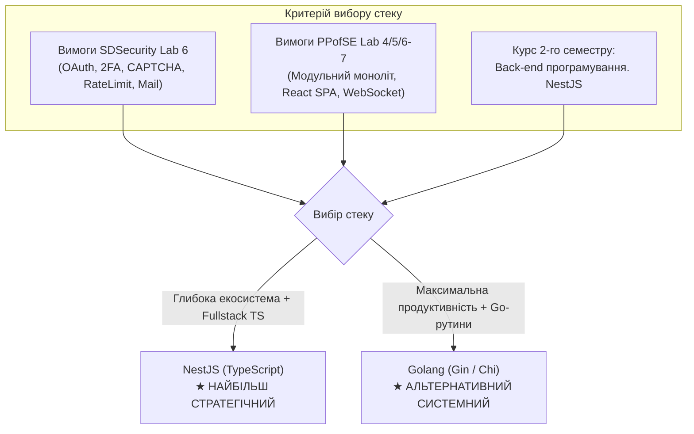
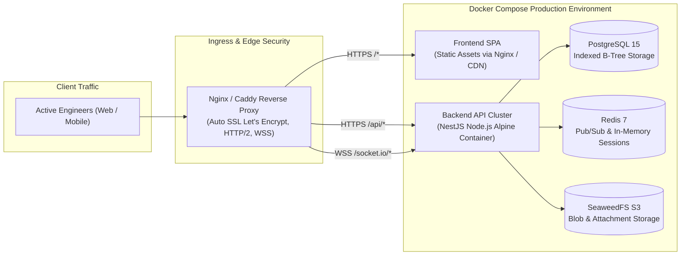

# Технічний стек та стратегія розробки сервісу автентифікації і безпеки
## Спільна архітектурна підготовка для курсів PPofSE та SDSecurity

> **Проєкт:** «Розроблення системи обліку та супроводу помилок у програмному забезпеченні» (*Bug / Issue Tracking System*)  
> **Робоча директорія застосунку:** `/home/finkord/dev/PPofSE/software/`  
> **Академічний контекст:**
> - Дисципліна 1: **Професійна практика програмної інженерії (PPofSE)** — Варіант 16 (Лабораторні 1–5 спроєктовано; Лаб 6–7: розробка фронтенду та інтеграція з REST API).
> - Дисципліна 2: **Безпека програм та даних (SDSecurity)** — Лабораторна робота № 6 (Проєкт: «Розробка безпечної системи управління обліковими записами», 15 балів, 7 завдань + відеозвіт).
> - Майбутня дисципліна (2-й семестр): **«Back-end програмування. NestJS»**.

---

## 1. Синергія вимог: SDSecurity Lab 6 та PPofSE

Замість створення двох окремих ізольованих застосунків, сервіс автентифікації, розроблений у межах репозиторію `PPofSE/software/`, повністю закриває:
1. **Усі 7 завдань проєкту SDSecurity Lab 6** (відповідає найвищому рівню вимог безпеки).
2. **Вимогу FR-01 та модуль Auth & User Service з архітектури PPofSE Lab 4/5** (повноцінний бекенд для майбутнього вебклієнта Lab 6–7 на React SPA).

### Матриця відповідності завдань SDSecurity Lab 6 та функціоналу Bug Tracker

| № Завдання SDSecurity | Вимога лабораторного проєкту SDSecurity | Реалізація в системі обліку помилок (PPofSE) | Архітектурний компонент |
| :---: | :--- | :--- | :--- |
| **Завдання 1** (3 б.) | Реєстрація та логін; політика паролів (≥8 симв., великі/малі, цифра, спецсимвол); перевірка сили пароля; гешування; профіль; логаут. | Модуль реєстрації співробітників (QA, Dev, PM, Admin), видача JWT (Access + Refresh в `httpOnly` cookie). | `AuthModule`, `UsersModule`, `PasswordValidator` |
| **Завдання 2** (2 б.) | Механізм CAPTCHA для захисту форми реєстрації від ботів. | Захист публічного ендпоінту реєстрації від спам-ботів (Cloudflare Turnstile / Google reCAPTCHA v2/v3). | `CaptchaGuard` / `CaptchaService` |
| **Завдання 3** (2 б.) | Активація облікового запису через email з одноразовим тимчасовим токеном; відображення статусу в профілі. | Захист робочого простору від неперевірених акаунтів; активація за токеном з обмеженим TTL (наприклад, 24 години). | `MailService`, `EmailConfirmationController` |
| **Завдання 4** (2 б.) | Захист від Brute Force (rate limiting, тимчасове блокування); журнал аудиту входів для Admin; блокування/розблокування користувачів. | Захист API шлюзу від підбору паролів; фіксація IP, User-Agent, статусу входу; панель адміністрування безпеки. | `ThrottlerGuard`, `SecurityAuditLog`, `AdminUsersController` |
| **Завдання 5** (2 б.) | Двофакторна автентифікація 2FA (TOTP через Google Authenticator / Authy або OTP на email); увімкнення/вимкнення в профілі. | Посилений захист облікових записів розробників і менеджерів; генерація секрету TOTP, QR-коду та верифікація 6-значного коду. | `TwoFactorAuthService`, `TwoFactorGuard` |
| **Завдання 6** (2 б.) | Автентифікація через зовнішнього провайдера (OpenID Connect / OAuth2: Google, GitHub). | Швидкий вхід розробників через GitHub або корпоративний Google Workspace. | `PassportStrategy (GitHub / Google OAuth2)` |
| **Завдання 7** (2 б.) | Відновлення пароля через email з одноразовим безпечним токеном з обмеженим терміном дії. | Скидання пароля для користувачів системи з перевіркою криптографічного токена (TTL 15–30 хв). | `PasswordResetService`, `MailService` |
| **RBAC** | Розмежування прав: User (власний профіль) та Admin (список користувачів, логи входів, блокування). | Системна рольова модель `ADMIN` vs `USER` (як спроєктовано в PPofSE Lab 4 Таблиця 4.3 та Lab 5 `users.system_role`). | `RolesGuard`, `@Roles('ADMIN')` |

---

## 2. Порівняльний аналіз бекенд-стеку: Golang vs NestJS

Користувач розглядає варіант **Golang** як основний бекенд, однак у другому семестрі заплановано спеціалізований курс **«Back-end програмування. NestJS»**. Нижче наведено всебічний інженерний та академічний аналіз обох платформ.



### Детальне порівняння технологій

| Характеристика / Критерій | Golang (Gin / Fiber / Chi) | NestJS (TypeScript + Express/Fastify) | Вплив на проєкт та вердикт |
| :--- | :--- | :--- | :--- |
| **Архітектурний патерн** | Свобода стилю (Package-oriented / Clean Architecture). Немає єдиного стандарту DI, багато ручного зв'язування. | **Модульний моноліт з коробки** (`@Module`, `@Controller`, `@Injectable`, IoC Container). Повна відповідність дизайну Lab 4. | **NestJS 1:0 Go** — Архітектура PPofSE Lab 4 проектувалась як шарувата клієнт-серверна з модулями (`Auth`, `Issue`, `Project`). У NestJS це нативна структура. |
| **Екосистема автентифікації та безпеки (SDSecurity)** | Необхідно вручну зв'язувати бібліотеки: `golang.org/x/oauth2`, `pquerna/otp`, `argon2`, власні middleware для rate-limit. | **Готові перевірені enterprise-рішення:** `@nestjs/passport` (Passport.js), `passport-jwt`, `passport-google-oauth20`, `passport-github2`, `otplib`, `@nestjs/throttler`. | **NestJS 2:0 Go** — Реалізація 7 завдань SDSecurity Lab 6 у NestJS займає у 2.5–3 рази менше рутинного boilerplate-коду. |
| **Валідація та DTO** | Структурні теги (`binding:"required,email"`), ручна валідація парольних політик або сторонній `validator/v10`. | Декларативні валідатори `class-validator` (`@IsEmail()`, `@IsStrongPassword()`, `@Matches()`) з автоматичним трансформуванням типів. | **NestJS 3:0 Go** — Зручна та безпечна валідація складної політики паролів (Завдання 1) безпосередньо в DTO класах. |
| **OpenAPI / Swagger документація** | Потрібні генератори коду (`swag / gin-swagger`), анотації в коментарях, які часто розсинхронізовуються. | Модуль `@nestjs/swagger` автоматично інспектує DTO та декоратори, генеруючи інтерактивний Swagger UI за 5 хвилин. | **NestJS 4:0 Go** — Критично для відеозвіту SDSecurity (демонстрація API) та для підключення React-фронтенду в PPofSE Lab 6–7. |
| **Продуктивність та споживання ресурсів** | **Виняткова:** компіляція в нативний бінарник, мікросекундний відгук, 15–30 МБ RAM, потужні Goroutines для WebSockets. | Дуже висока (Node.js V8 event loop), 70–120 МБ RAM, підтримка WebSockets через Socket.IO / WS Gateway. | **Go 4:1 NestJS** — Go перевершує за швидкістю та пам'яттю, але для навантаження навчального/корпоративного трекера різниця непомітна. |
| **Синхронізація з фронтендом (PPofSE Lab 6-7)** | Різні мови (Go на бекенді, TypeScript на фронтенді). Необхідно дублювати інтерфейси моделей і DTO. | **Fullstack TypeScript:** єдина мовна екосистема, спільні типи, спільні DTO, відсутність контекстного перемикання. | **NestJS 5:1 Go** — Спрощує виконання Лаб 6–7 (розробка React UI). |
| **Академічна перспектива** | Немає окремого курсу в поточному навчальному плані (хоча Go є цінним для DevOps/хмарних сервісів). | **Пряма підготовка до курсу 2-го семестру «Back-end програмування. NestJS».** | **NestJS 6:1 Go** — **Вирішальний фактор.** |

---

## 3. Можливості NestJS та його ключове застосування для проєкту

NestJS є прогресивним Node.js фреймворком для створення масштабованих серверних застосунків. Він поєднує найкращі патерни **OOP (об'єктно-орієнтованого програмування)**, **FP (функціонального програмування)** та **FRP (реактивного програмування)**.

### Основні можливості NestJS, релевантні для Bug Tracker та SDSecurity:

1. **Модульна декомпозиція (`Modules`):**
   - Кожен домен проєкту інкапсульовано: `AuthModule`, `UsersModule`, `SecurityLogsModule`, `ProjectsModule`, `IssuesModule`.
   - Модулі чітко експортують лише те, що потрібно іншим (ідеальне дотримання Single Responsibility Principle).

2. **Впровадження залежностей (Dependency Injection / IoC):**
   - Легке підключення репозиторіїв СУБД, поштових сервісів, кешування Redis, сервісів шифрування та зовнішніх API.
   - Спрощене юніт- та інтеграційне тестування через підміну сервісів моками (`Test.createTestingModule`).

3. **Захисні бар'єри (Guards) та перехоплювачі (Interceptors):**
   - `JwtAuthGuard`: автоматична валідація токенів у заголовках `Authorization: Bearer <token>`.
   - `RolesGuard`: декларативний контроль доступу через `@Roles('ADMIN')`.
   - `TwoFactorGuard`: вимога проходження другого фактора для критичних операцій.
   - `LoggingInterceptor`: автоматичний запис часу виконання та параметрів запитів.

4. **Декларативні конвеєри валідації (Pipes):**
   - Глобальний `ValidationPipe`: фільтрує вхідний JSON, видаляє несанкціоновані поля (`whitelist: true`), повертає зрозумілі клієнту 400 Bad Request помилки.

5. **Інтеграція з базами даних (TypeORM / Prisma):**
   - Повна підтримка PostgreSQL 15+, міграції схеми, робота зі створеною в PPofSE Lab 5 структурою даних.

6. **Вбудована підтримка WebSockets (Gateways):**
   - Нативний `@WebSocketGateway()` для трансляції змін статусів завдань на інтерактивній Kanban-дошці (вимога PPofSE Lab 4/Lab 6).

---

## 4. Архітектурна реалізація завдань SDSecurity Lab 6 у NestJS

### 4.1. Завдання 1: Реєстрація, складна політика паролів та Argon2id
- **Політика паролів:**
  - Мінімальна довжина: 8 символів.
  - Обов'язкова наявність: великої літери (`(?=.*[A-Z])`), малої літери (`(?=.*[a-z])`), цифри (`(?=.*\d)`), спецсимволу (`(?=.*[@$!%*?&^#()_+\-=\[\]{};':"\\|,.<>\/])`).
- **Стійке гешування:**
  - Застосування алгоритму **Argon2id** (переможець Password Hashing Competition, стійкий до атак на GPU/ASIC та time-memory trade-off) або **bcrypt** (cost factor 12).
- **DTO валідація в NestJS:**
  ```typescript
  import { IsEmail, IsNotEmpty, Matches, MinLength } from 'class-validator';

  export class RegisterDto {
    @IsNotEmpty()
    fullName: string;

    @IsEmail({}, { message: 'Invalid email address' })
    email: string;

    @MinLength(8, { message: 'Password must be at least 8 characters long' })
    @Matches(/((?=.*\d)|(?=.*\W+))(?![.\n])(?=.*[A-Z])(?=.*[a-z]).*$/, {
      message: 'Password must contain uppercase, lowercase, number, and special character',
    })
    password: string;

    @IsNotEmpty({ message: 'CAPTCHA token is required' })
    captchaToken: string;
  }
  ```

### 4.2. Завдання 2: Механізм CAPTCHA проти ботів
- Сервіс `CaptchaService` відправляє верифікаційний HTTPS-запит до провайдера (наприклад, Cloudflare Turnstile або Google reCAPTCHA) перед створенням запису в базі даних.
- Захищає сервер від автоматизованого створення мільйонів фейкових користувачів.

### 4.3. Завдання 3: Активація облікового запису через Email
- Генерація криптографічно стійкого токена: `crypto.randomBytes(32).toString('hex')`.
- Збереження в таблиці `users`: `activation_token`, `activation_token_expires_at` (TTL = 24 години), `is_activated = false`.
- Відправка листа через `@nestjs-modules/mailer` / Nodemailer з посиланням:
  `http://localhost:3000/api/v1/auth/activate?token=...`
- Відображення статусу `is_activated` у відповіді ендпоінту `/api/v1/users/me`.

### 4.4. Завдання 4: Захист від Brute Force та журнал аудиту входів
- **Rate Limiting:** використання `@nestjs/throttler` (наприклад, максимум 5 запитів на логін за 1 хвилину з одного IP).
- **Блокування після невдалих спроб:**
  - Лічильник `failed_login_attempts`. При досягненні 5 невдалих спроб встановлюється `locked_until = NOW() + INTERVAL '15 minutes'`.
- **Журнал безпеки (`login_audit_logs`):**
  - Фіксуються всі спроби: `user_id`, `email`, `ip_address`, `user_agent`, `status` (`SUCCESS`, `FAILED_PASSWORD`, `ACCOUNT_LOCKED`, `BLOCKED_BY_ADMIN`), `timestamp`.
- **Адміністративні ендпоінти:**
  - `GET /api/v1/admin/security/login-logs` — перегляд журналу спроб входу.
  - `PATCH /api/v1/admin/users/:id/block` — ручне блокування облікового запису (`is_blocked = true`).
  - `PATCH /api/v1/admin/users/:id/unblock` — зняття блокування.

### 4.5. Завдання 5: Двофакторна автентифікація (2FA / TOTP)
- Використання стандарту **RFC 6238 (TOTP)** за допомогою бібліотеки `otplib`.
- **Процес підключення:**
  1. Користувач у профілі викликає `POST /api/v1/auth/2fa/generate`.
  2. Сервер генерує унікальний секретний ключ і повертає QR-код (data-url через бібліотеку `qrcode`).
  3. Користувач сканує QR-код у Google Authenticator / Authy та вводить 6-значний код для підтвердження `POST /api/v1/auth/2fa/enable`.
  4. В базі фіксується: `two_factor_enabled = true`.
- **Процес входу з 2FA:**
  1. Логін і пароль вірні $\rightarrow$ сервер повертає тимчасовий токен попередньої авторизації: `{ require2FA: true, tempToken: "..." }`.
  2. Клієнт надсилає `POST /api/v1/auth/2fa/verify` із 6-значним кодом.
  3. Після успішної перевірки видаються фінальні `accessToken` та `refreshToken`.

### 4.6. Завдання 6: Вхід через зовнішнього провайдера (OAuth2 / OIDC)
- Використання `@nestjs/passport` зі стратегією `passport-github2` або `passport-google-oauth20`.
- Потік авторизації:
  1. Клієнт переходить на `/api/v1/auth/github`.
  2. GitHub запитує підтвердження $\rightarrow$ редірект на `/api/v1/auth/github/callback`.
  3. Сервер знаходить або автоматично створює обліковий запис користувача з `oauth_provider = 'GITHUB'`, `oauth_id = ...`, генерує сесійні токени та перенаправляє на фронтенд.

### 4.7. Завдання 7: Відновлення пароля через Email
- Ендпоінт `POST /api/v1/auth/forgot-password` приймає email.
- Генерується безпечний одноразовий токен `reset_token`, хешується перед збереженням або зберігається з `reset_token_expires_at = NOW() + INTERVAL '15 minutes'`.
- Користувачу надсилається лист із захищеним посиланням на форму скидання.
- Ендпоінт `POST /api/v1/auth/reset-password` валідує токен, перевіряє нову політику пароля (Завдання 1), оновлює хеш та інвалідує старі сесії.

---

## 5. Узгоджена схема бази даних (PostgreSQL 15+)

Нижче наведено розширення таблиці `users` (спроєктованої в PPofSE Lab 5) та створення нової таблиці `login_audit_logs`, що повністю підтримує всі вимоги обох курсів.

```sql
-- Extended 'users' table supporting Bug Tracker + SDSecurity Lab 6
CREATE TABLE IF NOT EXISTS users (
    id BIGSERIAL PRIMARY KEY,
    full_name VARCHAR(100) NOT NULL,
    email VARCHAR(255) NOT NULL UNIQUE,
    password_hash VARCHAR(255),                     -- Nullable if OAuth-only user
    system_role VARCHAR(20) NOT NULL DEFAULT 'USER' 
        CHECK (system_role IN ('ADMIN', 'USER')),

    -- SDSecurity: Account Activation
    is_activated BOOLEAN NOT NULL DEFAULT FALSE,
    activation_token VARCHAR(255),
    activation_token_expires_at TIMESTAMPTZ,

    -- SDSecurity: Brute Force & Account Lockout
    failed_login_attempts INT NOT NULL DEFAULT 0,
    locked_until TIMESTAMPTZ,
    is_blocked BOOLEAN NOT NULL DEFAULT FALSE,

    -- SDSecurity: Two-Factor Authentication (2FA)
    two_factor_enabled BOOLEAN NOT NULL DEFAULT FALSE,
    two_factor_secret VARCHAR(255),

    -- SDSecurity: OAuth2 / OpenID Connect
    oauth_provider VARCHAR(50) DEFAULT 'LOCAL' 
        CHECK (oauth_provider IN ('LOCAL', 'GITHUB', 'GOOGLE')),
    oauth_id VARCHAR(255),

    -- SDSecurity: Password Reset
    reset_password_token VARCHAR(255),
    reset_password_expires_at TIMESTAMPTZ,

    created_at TIMESTAMPTZ NOT NULL DEFAULT CURRENT_TIMESTAMP,
    updated_at TIMESTAMPTZ NOT NULL DEFAULT CURRENT_TIMESTAMP
);

-- SDSecurity: Security Login Audit Logs (Task 4)
CREATE TABLE IF NOT EXISTS login_audit_logs (
    id BIGSERIAL PRIMARY KEY,
    user_id BIGINT REFERENCES users(id) ON DELETE SET NULL,
    attempted_email VARCHAR(255) NOT NULL,
    ip_address VARCHAR(45) NOT NULL,
    user_agent TEXT,
    status VARCHAR(30) NOT NULL 
        CHECK (status IN ('SUCCESS', 'FAILED_PASSWORD', 'BLOCKED', 'LOCKED_TEMPORARY', 'REQUIRE_2FA', '2FA_SUCCESS', '2FA_FAILED')),
    failure_reason VARCHAR(255),
    created_at TIMESTAMPTZ NOT NULL DEFAULT CURRENT_TIMESTAMP
);

CREATE INDEX idx_login_logs_email_created ON login_audit_logs(attempted_email, created_at);
CREATE INDEX idx_login_logs_user_id ON login_audit_logs(user_id);
```

---

## 6. Рекомендована структура проєкту в `/software/`

Для чистоти архітектури та зручності розробки організовується модульна структура монорепозиторію:

```
PPofSE/software/
├── docker-compose.yml              # PostgreSQL 15, Redis 7, Mailpit, SeaweedFS (S3-сумісне сховище вкладень)
├── backend/                        # NestJS REST & WebSocket API сервіс
│   ├── package.json
│   ├── tsconfig.json
│   ├── src/
│   │   ├── main.ts                 # Точка входу, Swagger setup, CORS, ValidationPipe
│   │   ├── app.module.ts           # Головний модуль
│   │   ├── common/                 # Загальні Guards, Decorators, Filters, Pipes
│   │   │   ├── decorators/         # @Roles(), @CurrentUser()
│   │   │   ├── guards/             # JwtAuthGuard, RolesGuard, ThrottlerBehindProxyGuard
│   │   │   └── filters/            # GlobalHttpExceptionFilter
│   │   ├── config/                 # Конфігурація середовища (.env)
│   │   ├── database/               # TypeORM конфігурація та міграції
│   │   └── modules/
│   │       ├── auth/               # Реєстрація, логін, токени, 2FA, OAuth, активація, скидання пароля
│   │       ├── users/              # Управління профілями, блокування/розблокування адміном
│   │       ├── security-audit/     # Журнал логування спроб входу (SDSecurity Завдання 4)
│   │       ├── mail/               # Відправка листів активації та відновлення пароля (Mailpit / SMTP)
│   │       ├── captcha/            # Сервіс верифікації CAPTCHA (SDSecurity Завдання 2)
│   │       ├── attachments/        # (Для PPofSE) Збереження файлів у SeaweedFS через S3 API
│   │       ├── projects/           # (Для PPofSE) Управління проєктами
│   │       └── issues/             # (Для PPofSE) Трекінг помилок, життєвий цикл FSM
│   └── test/                       # E2E та юніт-тести
└── frontend/                       # (Для PPofSE Лаб 6-7) React SPA (Vite + TypeScript + Tailwind CSS)
```

> [!TIP]
> **Mailpit у Docker Compose для ідеального відеозвіту:**  
> Mailpit — це легковажний інструмент локального тестування пошти. Він надає веб-інтерфейс на порту `8025`, де в реальному часі миттєво з'являються всі відправлені системою листи активації та скидання пароля з кнопками й одноразовими токенами. Це дозволяє бездоганно продемонструвати Завдання 3 та Завдання 7 у відеозвіті без потреби налаштовувати реальні поштові скриньки Google/Sendgrid.

---

## 7. Об'єктне сховище: Заміна MinIO на SeaweedFS

В архітектурній діаграмі Лабораторної роботи № 4 згадувався MinIO як S3-сумісне сховище для бінарних файлів вкладень (`attachments`: скріншоти, дампи логів, скрінкасти помилок).

Проте в сучасній розробці **SeaweedFS** є значно кращою альтернативою MinIO:
1. **Ліцензійна чистота та Open Source:** MinIO перейшов на жорстку ліцензію AGPLv3 і комерційні обмеження, тоді як SeaweedFS розповсюджується за вільною ліцензією **Apache 2.0**.
2. **Розроблено на Go:** SeaweedFS написаний на мові **Go**, демонструє блискавичну швидкодію, споживає мінімум оперативної пам'яті (від 20–30 МБ проти 250+ МБ у MinIO) та запускається єдиним компактним Docker-контейнером (`chrislusf/seaweedfs`).
3. **Спеціалізація на дрібних і середніх файлах:** SeaweedFS спроєктований за архітектурою Facebook Haystack, оптимізований саме для зберігання мільйонів зображень і вкладень без навантаження на дискові дескриптори.
4. **100% S3 API:** Підтримує стандартний протокол AWS S3 (`weed server -s3`), що дозволяє підключати стандартний AWS SDK у NestJS (`@aws-sdk/client-s3`) без прив'язки до пропрієтарних бібліотек.

---

## 8. Аналіз використання Go в бізнес-логіці vs Моніторинг-демон

Було проведено дослідження, чи доцільно виносити частину бізнес-логіки баг-трекера на Go (наприклад, обробку вкладень, генерацію прев'ю чи парсинг вебхуків Git):
- **Висновок:** Для ядра баг-трекера це створило б штучний **оверхед розподілених сервісів** (IPC через gRPC/REST, мережеві затримки, складність локального запуску, дублювання DTO). У NestJS обробка вкладень і парсинг виконуються кількома рядками коду всередині моноліту.
- **Стратегічне рішення:** Залишаємо ядро баг-трекера цілісним та чистим на **NestJS**. Мову **Go** резервуємо на фінальний етап проєкту як ідею для розробки **зовнішнього демона моніторингу IT-інфраструктури** (збір метрик контейнерів, здоров'я сервісів, автоматична генерація алертів), що стане прямою базою для майбутньої дипломної роботи.

---

## 9. Deployment Strategy & Capacity Planning (Scalability Analysis)

### 9.1. Future Deployment Architecture

The proposed stack (**NestJS + Vite/React SPA + PostgreSQL 15 + Redis 7 + SeaweedFS**) follows industry-standard containerized best practices. It eliminates proprietary cloud lock-in and vendor dependencies.



#### Production Deployment Options:
1. **Single-Node VPS (Cost-Effective: $5–$10/mo, e.g., Hetzner / DigitalOcean):**
   - Single command deployment: `docker compose -f docker-compose.prod.yml up -d --build`.
   - **Automated SSL/TLS:** Handled by Caddy or Nginx with Let's Encrypt auto-renewal.
   - **Automated CI/CD:** A lightweight GitHub Actions workflow triggers automated unit tests, builds Docker images, and executes a zero-downtime rolling restart via SSH.
2. **Decoupled Edge / Cloud Deployment:**
   - **Frontend:** Zero-cost global static hosting on **Cloudflare Pages** or **Vercel** with global CDN caching.
   - **Backend & Database:** Containerized service hosted on **Railway**, **Render**, or a dedicated cloud VPS.

---

### 9.2. Workload Profile & User Concurrency Capacity

Unlike public-facing social media or high-frequency trading platforms, an internal/enterprise **Bug Tracking System** operates under a predictable SaaS workload:
- An active team member (QA, Developer, PM) interacts with the system periodically: browsing Kanban boards, updating issue statuses, reading comments, or uploading screenshots.
- **Average Active User Load:** Each online user generates between **0.1 and 0.2 Requests Per Second (RPS)** during active workflows. Idle tabs generate negligible overhead (~0.04 RPS via WebSocket keep-alive ping).

---

### 9.3. Hardware Tier Capacity Sizing

| Deployment Tier | Server Resources | API Throughput | Concurrent Online Users | Total Registered Accounts |
| :--- | :--- | :---: | :---: | :---: |
| **Entry VPS** (Hetzner / DO) | **2 vCPU, 4 GB RAM** (~$7/mo) | **800 – 1,500 RPS** | **1,500 – 3,000 active users** | **10,000 – 50,000 accounts** |
| **Production VPS** | **4 vCPU, 8 GB RAM** (~$15/mo) | **2,500 – 4,000 RPS** | **5,000 – 10,000 active users** | **100,000+ accounts** |
| **Horizontally Scaled** | Multiple App Nodes + Managed DB | **10,000+ RPS** | **25,000 – 50,000+ active users** | **Enterprise Scale** |

---

### 9.4. Why This Architecture Scales Efficiently

1. **Optimized Relational Schema (PostgreSQL 15):**
   - High-cardinality queries are fully backed by composite B-Tree indexes (`idx_issues_project_status`, `idx_issues_assignee`, `idx_comments_issue`), ensuring execution times under **2–5 ms**.
2. **In-Memory Acceleration (Redis 7):**
   - Session validation, rate-limiting counters, and WebSocket real-time broadcast pub/sub run in RAM, handling **over 80,000 ops/sec** with sub-millisecond latency.
3. **Dedicated Blob Offloading (SeaweedFS):**
   - Large media files (attachments up to 25 MB) are streamed directly to/from SeaweedFS via S3 pre-signed URLs, preventing file I/O from blocking backend API threads or inflating database backups.
4. **Stateless Backend Design:**
   - Because NestJS nodes store no in-memory session state (relying on cryptographic JWT tokens and Redis), horizontal scaling requires only adjusting replica counts (`scale: backend=3`) behind a load balancer.

---

## 10. Action Plan & Next Steps (Milestone 1)

1. **Step 1: Local Development Infrastructure**
   - Configure `docker-compose.yml` under `PPofSE/software/` with `postgres:15-alpine`, `redis:7-alpine`, `axllent/mailpit`, and `chrislusf/seaweedfs`.
2. **Step 2: NestJS Backend Initialization**
   - Scaffold `PPofSE/software/backend` using `@nestjs/cli` (v12+ on Node.js v24 Active LTS).
   - Install production dependencies: `@nestjs/typeorm`, `pg`, `@nestjs/passport`, `passport-jwt`, `passport-google-oauth20`, `passport-github2`, `bcrypt` / `argon2`, `class-validator`, `class-transformer`, `@nestjs/swagger`, `otplib`, `qrcode`, `@nestjs-modules/mailer`, `@nestjs/throttler`.
3. **Step 3: Security Core Implementation (SDSecurity Lab 6)**
   - Implement `AuthModule`: User registration with strict password policies, CAPTCHA validation, and email activation via Mailpit.
   - Implement Brute Force Protection: Throttler + audit logging in `login_audit_logs` + 15-minute lockout after 5 failed attempts.
   - Implement 2FA TOTP: Secret generation, QR-code display, verification challenge.
   - Implement OAuth2 (GitHub / Google) and secure password reset workflow.
   - Implement Admin Security Endpoints: Inspect login audit logs, block/unblock accounts.
4. **Step 4: SDSecurity Lab 6 Video Report Recording**
   - Record demonstration of all 7 required lab tasks using Swagger UI, Mailpit, and Admin panel.
5. **Step 5: Frontend Development (PPofSE Lab 6–7)**
   - Initialize React SPA using Vite under `PPofSE/software/frontend`.
   - Implement authentication views, user security profiles with 2FA toggle, and Kanban boards connected to the live API.
