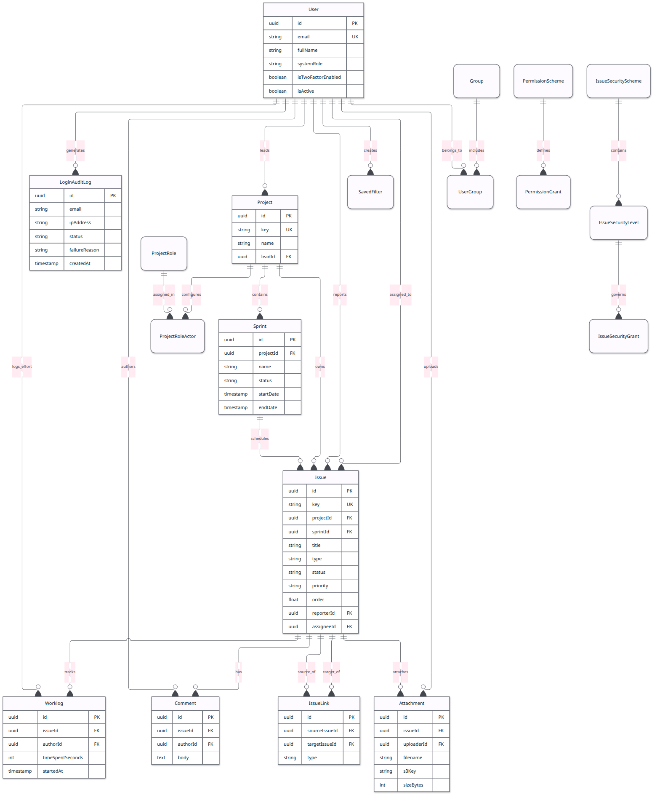
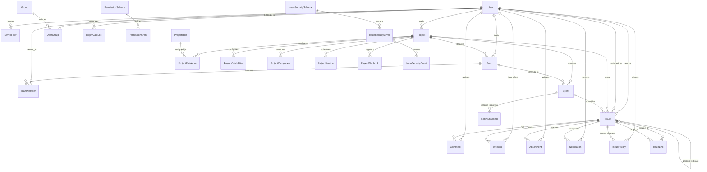

# Database Schema & Entity Relationships

This document details the PostgreSQL 15 database schema configured via TypeORM in the NestJS backend (`backend/src/`).

---

## 1. Entity-Relationship Diagram

### Rendered ER View

<b>Click to expand Mermaid Source Code</b>

---

## 2. Entity Catalog (29 Domain Entities)

### A. Identity & Core Users (`modules/users/`)
1. **[`User`](../../backend/src/modules/users/entities/user.entity.ts)**:
   - Primary table: `users`
   - Attributes: `id` (int), `email` (UK), `fullName`, `passwordHash` (Argon2id), `systemRole` (`ADMIN`, `USER`), `jobTitle`, `twoFactorSecret`, `isTwoFactorEnabled`, `isActive`, `activationToken`, `lockoutUntil`, `failedLoginAttempts`, `avatarUrl`, `preferences` (JSONB).
2. **[`SavedFilter`](../../backend/src/modules/users/entities/saved-filter.entity.ts)**:
   - Primary table: `saved_filters`
   - Attributes: `id` (int), `userId` (FK to `users`), `name`, `criteria` (JQL), `description`, `isFavorite`, `createdAt`.
   - Indexes: B-Tree on `userId`, Composite B-Tree on `(userId, isFavorite)`.

### B. Projects, Workspaces & Taxonomies (`modules/projects/`, `modules/webhooks/`)
3. **[`Project`](../../backend/src/modules/projects/entities/project.entity.ts)**:
   - Primary table: `projects`
   - Attributes: `id` (int), `key` (UK, e.g. `CORE`, `UI`), `name`, `description`, `leadId` (FK to `users`), `permissionSchemeId`.
4. **[`ProjectQuickFilter`](../../backend/src/modules/projects/entities/quick-filter.entity.ts)**:
   - Primary table: `project_quick_filters`
   - Attributes: `id` (int), `projectId` (FK to `projects`), `name`, `jql`, `position` (int), `createdAt`, `updatedAt`.
   - Indexes: Composite B-Tree on `(projectId, position)`.
5. **[`ProjectComponent`](../../backend/src/modules/projects/entities/project-component.entity.ts)**:
   - Primary table: `project_components`
   - Attributes: `id` (int), `projectId` (FK to `projects`), `name`, `description`, `leadId` (FK to `users`, nullable), `createdAt`, `updatedAt`.
   - Indexes: Composite B-Tree on `(projectId, name)`.
6. **[`ProjectVersion`](../../backend/src/modules/projects/entities/project-version.entity.ts)**:
   - Primary table: `project_versions`
   - Attributes: `id` (int), `projectId` (FK to `projects`), `name`, `description`, `status` (`UNRELEASED`, `RELEASED`, `ARCHIVED`), `releaseDate`, `createdAt`, `updatedAt`.
   - Indexes: Composite B-Tree on `(projectId, status)`.
7. **[`ProjectWebhook`](../../backend/src/modules/webhooks/entities/project-webhook.entity.ts)**:
   - Primary table: `project_webhooks`
   - Attributes: `id` (int), `projectId` (FK to `projects`), `name`, `targetUrl`, `secret`, `events` (text array), `isActive`, `createdAt`, `updatedAt`.

### C. Sprints & Planning Iterations (`modules/sprints/`)
8. **[`Sprint`](../../backend/src/modules/sprints/entities/sprint.entity.ts)**:
   - Primary table: `sprints`
   - Attributes: `id` (int), `projectId` (FK to `projects`), `teamId` (FK to `teams`, nullable), `name`, `goal`, `status` (`PLANNED`, `ACTIVE`, `COMPLETED`), `capacityHours` (numeric 6,2, nullable), `startDate`, `endDate`.
   - Indexes: Composite B-Tree on `(projectId, status)`, B-Tree on `teamId`.
9. **[`SprintSnapshot`](../../backend/src/modules/sprints/entities/sprint-snapshot.entity.ts)**:
   - Primary table: `sprint_snapshots`
   - Attributes: `id` (int), `sprintId` (FK to `sprints`), `snapshotDate` (date), `plannedStoryPoints`, `remainingStoryPoints`, `remainingHours`, `completedStoryPoints`, `createdAt`.
   - Indexes: Unique composite B-Tree on `(sprintId, snapshotDate)`.

### D. Issue Tracking, Hierarchy & Change Forensics (`modules/issues/`)
10. **[`Issue`](../../backend/src/modules/issues/entities/issue.entity.ts)**:
    - Primary table: `issues`
    - Attributes: `id` (int), `key` (UK, e.g. `CORE-101`), `title`, `description`, `type` (`BUG`, `TASK`, `STORY`, `EPIC`, `SUBTASK`), `status` (`OPEN`, `IN_PROGRESS`, `RESOLVED`, `CLOSED`), `priority` (`LOW`, `MEDIUM`, `HIGH`, `CRITICAL`), `projectId`, `parentId` (FK to `issues`, nullable for subtasks), `sprintId` (FK to `sprints`, nullable), `componentId` (FK to `project_components`, nullable), `reporterId`, `assigneeId`, `estimateHours`, `timeSpentHours`, `labels` (text array, nullable).
    - Indexes:
      - B-Tree: `(projectId, status)`, `projectId`, `priority`, `assigneeId`, `reporterId`, `createdAt`, `sprintId`, `parentId`, `componentId`.
      - Unique B-Tree: `(projectId, issueNum)`.
      - GIN Index: `idx_issues_search_vector` on `to_tsvector('english', coalesce(title, '') || ' ' || coalesce(description, ''))`.
11. **[`IssueHistory`](../../backend/src/modules/issues/entities/issue-history.entity.ts)**:
    - Primary table: `issue_histories`
    - Attributes: `id` (int), `issueId` (FK to `issues`), `authorId` (FK to `users`), `fieldName` (varchar 50), `oldValue` (text, nullable), `newValue` (text, nullable), `createdAt`.
    - Indexes: B-Tree on `issueId`, Composite B-Tree on `(issueId, createdAt)`.
12. **[`Worklog`](../../backend/src/modules/issues/entities/worklog.entity.ts)**:
    - Primary table: `worklogs`
    - Attributes: `id` (int), `issueId` (FK to `issues`), `userId` (FK to `users`), `timeSpentHours` (numeric 5,2), `dateLogged` (date), `description`, `createdAt`.
    - Indexes: B-Tree on `dateLogged`, Composite B-Tree on `(userId, dateLogged)`, Composite B-Tree on `(issueId, dateLogged)`.
13. **[`Comment`](../../backend/src/modules/issues/entities/comment.entity.ts)**:
    - Primary table: `comments`
    - Attributes: `id` (int), `issueId` (FK to `issues`), `authorId` (FK to `users`), `body`, `createdAt`, `updatedAt`.
14. **[`Attachment`](../../backend/src/modules/issues/entities/attachment.entity.ts)**:
    - Primary table: `issue_attachments`
    - Attributes: `id` (int), `issueId` (FK to `issues`), `uploaderId` (FK to `users`), `filename`, `s3Key`, `mimeType`, `sizeBytes`.
15. **[`IssueLink`](../../backend/src/modules/issues/entities/issue-link.entity.ts)**:
    - Primary table: `issue_links`
    - Attributes: `id` (int), `sourceIssueId` (FK to `issues`), `targetIssueId` (FK to `issues`), `type` (`BLOCKS`, `IS_BLOCKED_BY`, `RELATES_TO`, `DUPLICATES`).

### E. Granular RBAC & Security Schemes (`modules/rbac/`)
16. **[`PermissionScheme`](../../backend/src/modules/rbac/entities/permission-scheme.entity.ts)**: Groups of permissions assigned to projects.
17. **[`PermissionGrant`](../../backend/src/modules/rbac/entities/permission-grant.entity.ts)**: Binds permissions (`CREATE_ISSUE`, `ASSIGN_ISSUE`, `DELETE_ISSUE`, etc.) to roles, groups, leads, assignees, or reporters.
18. **[`ProjectRole`](../../backend/src/modules/rbac/entities/project-role.entity.ts)**: Roles scoped to projects (e.g. `Administrators`, `Developers`, `Viewers`).
19. **[`ProjectRoleActor`](../../backend/src/modules/rbac/entities/project-role-actor.entity.ts)**: Maps specific users or groups to project roles within a project.
20. **[`Group`](../../backend/src/modules/rbac/entities/group.entity.ts)**: Organization groups (e.g., `all-users`, `Engineering-CORE`, `Security`).
21. **[`UserGroup`](../../backend/src/modules/rbac/entities/user-group.entity.ts)**: Membership join table linking users and groups.
22. **[`IssueSecurityScheme`](../../backend/src/modules/rbac/entities/issue-security-scheme.entity.ts)**: Schemes regulating access to confidential issues.
23. **[`IssueSecurityLevel`](../../backend/src/modules/rbac/entities/issue-security-level.entity.ts)**: Sensitivity tiers (e.g., `Internal Security Only`).
24. **[`IssueSecurityGrant`](../../backend/src/modules/rbac/entities/issue-security-grant.entity.ts)**: Whitelist actors granted access to a security level.

### F. In-App Notifications & Alerting (`modules/notifications/`)
25. **[`Notification`](../../backend/src/modules/notifications/entities/notification.entity.ts)**:
    - Primary table: `notifications`
    - Attributes: `id` (int), `userId` (FK to `users`), `actorId` (FK to `users`, nullable), `issueId` (FK to `issues`, nullable), `type` (`MENTIONED`, `ASSIGNED`, `UNASSIGNED`, `STATUS_CHANGED`, `COMMENT_ADDED`, `PRIORITY_CHANGED`, `SPRINT_ASSIGNED`), `title`, `message`, `isRead`, `snoozedUntil`, `createdAt`.
    - Indexes: Composite B-Tree on `(userId, isRead)`, Composite B-Tree on `(userId, createdAt)`, B-Tree on `issueId`.

### G. Scrum Teams & Delivery Units (`modules/teams/`)
26. **[`Team`](../../backend/src/modules/teams/entities/team.entity.ts)**:
    - Primary table: `teams`
    - Attributes: `id` (int), `name` (varchar 100), `description`, `projectId` (FK to `projects`), `leadId` (FK to `users`, nullable), `sprintCapacityHours` (numeric 6,2), `createdAt`, `updatedAt`.
    - Indexes: B-Tree on `projectId`, B-Tree on `leadId`.
27. **[`TeamMember`](../../backend/src/modules/teams/entities/team-member.entity.ts)**:
    - Primary table: `team_members`
    - Attributes: `id` (int), `teamId` (FK to `teams`), `userId` (FK to `users`), `role` (`SCRUM_MASTER`, `PRODUCT_OWNER`, `DEVELOPER`, `QA_ENGINEER`, `DESIGNER`), `weeklyCapacityHours` (numeric 5,2), `createdAt`, `updatedAt`.
    - Indexes: Unique composite B-Tree on `(teamId, userId)`, B-Tree on `userId`, B-Tree on `teamId`.

### H. Forensic Auditing (`modules/security-audit/`)
28. **[`LoginAuditLog`](../../backend/src/modules/security-audit/entities/login-audit-log.entity.ts)**:
    - Primary table: `login_audit_logs`
    - Attributes: `id` (int), `email`, `ipAddress`, `userAgent`, `status` (`SUCCESS`, `FAILURE`, `2FA_CHALLENGE`, `LOCKED_OUT`), `failureReason`, `createdAt`.

### I. VCS Integrations (`modules/vcs/`)
29. **[`VcsPullRequest`](../../backend/src/modules/vcs/entities/vcs-pull-request.entity.ts)**:
    - Primary table: `vcs_pull_requests`
    - Attributes: `id` (int), `issueId` (FK to `issues`), `prNumber` (int), `title`, `url`, `status` (`OPEN`, `MERGED`, `CLOSED`), `sourceBranch`, `targetBranch`, `authorName`, `createdAt`, `updatedAt`.
