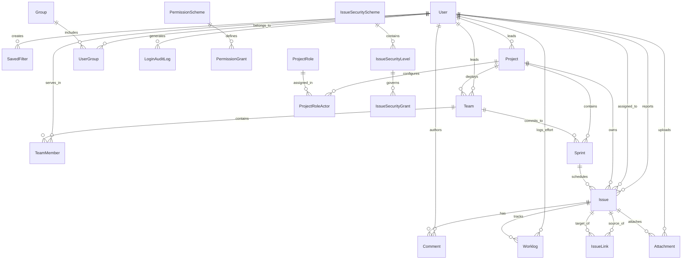

# Database Schema & Entity Relationships

This document details the PostgreSQL 15 database schema configured via TypeORM in the NestJS backend (`backend/src/`).

---

## 1. Entity-Relationship Diagram

### Rendered ER View

<b>Click to expand Mermaid Source Code</b>

---

## 2. Entity Catalog (21 Domain Entities)

### A. Identity & Core Users (`modules/users/`)
1. **[`User`](../../backend/src/modules/users/entities/user.entity.ts)**:
   - Primary table: `users`
   - Attributes: `id` (UUID), `email` (UK), `fullName`, `passwordHash` (Argon2id), `systemRole` (`ADMIN`, `USER`), `twoFactorSecret`, `isTwoFactorEnabled`, `isActive`, `activationToken`, `lockoutUntil`, `failedLoginAttempts`, `avatarUrl`, `preferences` (JSONB, default `'{}'`).
2. **[`SavedFilter`](../../backend/src/modules/users/entities/saved-filter.entity.ts)**:
   - Primary table: `saved_filters`
   - Attributes: `id` (int), `userId` (FK to `users`), `name`, `criteria` (JQL), `description` (varchar 255, nullable), `isFavorite` (boolean, default: false), `createdAt`.
   - Indexes: B-Tree on `userId`, Composite B-Tree `IDX_b662ff97a9da4077e8bcc07377` on `(userId, isFavorite)`.

### B. Projects, Sprints & Planning (`modules/projects/`, `modules/sprints/`)
3. **[`Project`](../../backend/src/modules/projects/entities/project.entity.ts)**:
   - Primary table: `projects`
   - Attributes: `id` (UUID), `key` (UK, e.g. `CORE`, `UI`), `name`, `description`, `leadId` (FK to `users`), `permissionSchemeId`.
4. **[`Sprint`](../../backend/src/modules/sprints/entities/sprint.entity.ts)**:
   - Primary table: `sprints`
   - Attributes: `id`, `projectId`, `teamId` (FK to `teams.id`, nullable), `name`, `goal`, `status` (`PLANNED`, `ACTIVE`, `COMPLETED`), `capacityHours` (numeric 6,2, nullable), `startDate`, `endDate`.

### C. Issue Tracking & Forensics (`modules/issues/`)
5. **[`Issue`](../../backend/src/modules/issues/entities/issue.entity.ts)**:
   - Primary table: `issues`
   - Attributes: `id`, `key` (UK, e.g. `CORE-101`), `title`, `description`, `type` (`BUG`, `TASK`, `STORY`, `EPIC`), `status` (`OPEN`, `IN_PROGRESS`, `RESOLVED`, `CLOSED`), `priority` (`LOW`, `MEDIUM`, `HIGH`, `CRITICAL`), `projectId`, `sprintId` (indexed FK to `sprints.id`, `onDelete: SET NULL`), `reporterId`, `assigneeId`, `estimateHours`, `timeSpentHours`.
   - Indexes:
     - B-Tree: `(projectId, status)`, `projectId`, `priority`, `assigneeId`, `reporterId`, `createdAt`, `sprintId`.
     - Unique B-Tree: `(projectId, issueNum)`.
     - GIN Index: `idx_issues_search_vector` on `to_tsvector('english', coalesce(title, '') || ' ' || coalesce(description, ''))` for sub-5ms full-text search.
6. **[`Worklog`](../../backend/src/modules/issues/entities/worklog.entity.ts)**:
   - Tracks logged engineering effort: `id`, `issueId` (FK to `issues`), `userId` (FK to `users`), `timeSpentHours` (numeric 5,2), `dateLogged` (date string `YYYY-MM-DD`), `description` (varchar 500, nullable), `createdAt`.
   - Indexes:
     - B-Tree: `idx_worklogs_date_logged` on `dateLogged`.
     - Composite B-Tree: `idx_worklogs_user_date` on `(userId, dateLogged)`.
     - Composite B-Tree: `idx_worklogs_issue_date` on `(issueId, dateLogged)`.
     - B-Tree: `idx_worklogs_created_at` on `createdAt`.
7. **[`Comment`](../../backend/src/modules/issues/entities/comment.entity.ts)**:
   - Threaded issue discussions: `id`, `issueId`, `authorId`, `body`, `createdAt`, `updatedAt`.
8. **[`Attachment`](../../backend/src/modules/issues/entities/attachment.entity.ts)**:
   - Metadata for S3 files: `id`, `issueId`, `uploaderId`, `filename`, `s3Key`, `mimeType`, `sizeBytes`.
9. **[`IssueLink`](../../backend/src/modules/issues/entities/issue-link.entity.ts)**:
   - Inter-issue relationships: `id`, `sourceIssueId`, `targetIssueId`, `type` (`BLOCKS`, `IS_BLOCKED_BY`, `RELATES_TO`, `DUPLICATES`).

### D. Granular RBAC & Security Schemes (`modules/rbac/`)
10. **[`PermissionScheme`](../../backend/src/modules/rbac/entities/permission-scheme.entity.ts)**: Groups of permissions assigned to projects.
11. **[`PermissionGrant`](../../backend/src/modules/rbac/entities/permission-grant.entity.ts)**: Binds permissions (`CREATE_ISSUE`, `ASSIGN_ISSUE`, `CLOSE_ISSUE`) to roles, groups, or leads.
12. **[`ProjectRole`](../../backend/src/modules/rbac/entities/project-role.entity.ts)**: Roles scoped to projects (e.g. `Developer`, `Project Admin`).
13. **[`ProjectRoleActor`](../../backend/src/modules/rbac/entities/project-role-actor.entity.ts)**: Maps specific users or groups to project roles within a project.
14. **[`Group`](../../backend/src/modules/rbac/entities/group.entity.ts)**: Organization groups (e.g., `Engineering-CORE`, `Security`).
15. **[`UserGroup`](../../backend/src/modules/rbac/entities/user-group.entity.ts)**: Membership join table linking users and groups.
16. **[`IssueSecurityScheme`](../../backend/src/modules/rbac/entities/issue-security-scheme.entity.ts)**: Schemes regulating access to confidential issues.
17. **[`IssueSecurityLevel`](../../backend/src/modules/rbac/entities/issue-security-level.entity.ts)**: Sensitivity tiers (e.g., `Internal Security Only`).
18. **[`IssueSecurityGrant`](../../backend/src/modules/rbac/entities/issue-security-grant.entity.ts)**: Whitelist actors granted access to a security level.

### E. Forensic Auditing (`modules/security-audit/`)
19. **[`LoginAuditLog`](../../backend/src/modules/security-audit/entities/login-audit-log.entity.ts)**:
   - Primary table: `login_audit_logs`
   - Attributes: `id`, `email`, `ipAddress`, `userAgent`, `status` (`SUCCESS`, `FAILURE`, `2FA_CHALLENGE`, `LOCKED_OUT`), `failureReason`, `createdAt`.

### F. Scrum Teams & Delivery Units (`modules/teams/`)
20. **[`Team`](../../backend/src/modules/teams/entities/team.entity.ts)**:
   - Primary table: `teams`
   - Attributes: `id` (int), `name` (varchar 100), `description` (varchar 255, nullable), `projectId` (int, FK to `projects`), `leadId` (int, FK to `users`, nullable), `sprintCapacityHours` (numeric 6,2, default: 80.00), `createdAt`, `updatedAt`.
   - Indexes: B-Tree `idx_teams_project_id` on `projectId`, B-Tree `idx_teams_lead_id` on `leadId`.
21. **[`TeamMember`](../../backend/src/modules/teams/entities/team-member.entity.ts)**:
   - Primary table: `team_members`
   - Attributes: `id` (int), `teamId` (int, FK to `teams`), `userId` (int, FK to `users`), `role` (`SCRUM_MASTER`, `PRODUCT_OWNER`, `DEVELOPER`, `QA_ENGINEER`, `DESIGNER`), `weeklyCapacityHours` (numeric 5,2, default: 40.00), `createdAt`, `updatedAt`.
   - Indexes: Unique composite B-Tree `idx_team_members_team_user` on `(teamId, userId)`, B-Tree `idx_team_members_user_id` on `userId`, B-Tree `idx_team_members_team_id` on `teamId`.
