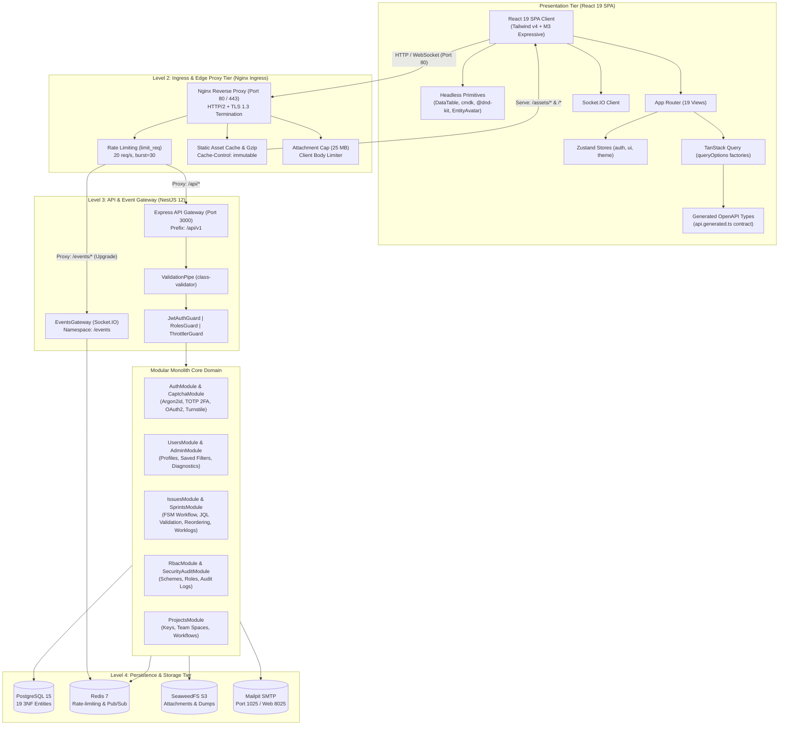

# System Architecture & Infrastructure Overview

This document provides a comprehensive technical overview of the **BugTracker** application architecture, component interactions, and infrastructure runtime environment.

---

## 1. High-Level Architecture Diagram

### Rendered Architecture View

<b>Click to expand Mermaid Source Code</b>

---

## 2. Technology Stack & Service Endpoints

| Layer | Technology | Runtime / Port | Role & Key Responsibilities |
|---|---|---|---|
| **Ingress & Edge Proxy**| Nginx Alpine | Port `80` (HTTP) / `443` (TLS) *(Production Tier)* | Production single unified entry point, edge IP rate-limiting (`limit_req`), static bundle cache, 25MB body limit. |
| **Backend API** | NestJS 12 (TypeScript) | Node.js 24 LTS / Port `3000` | Modular monolith architecture (`/api/v1`), Swagger (`/api/docs`), JWT cookies, input validation. |
| **Frontend SPA** | React 19 + Vite 8 | Port `5173` | Single-page application, Tailwind CSS v4, Material Design 3 Expressive theme, TanStack Query. |
| **Relational Database** | PostgreSQL 15 | Port `5432` | Relational 3NF persistence managed via TypeORM with 19 domain entities. |
| **Cache & Pub/Sub** | Redis 7 | Port `6379` | Fast session caching (`user:session:*`), RBAC permissions caching, sliding-window rate limiting, and horizontal Socket.IO Redis adapter distribution. |
| **Object Storage** | SeaweedFS (S3 API) | S3 Port `8333` / Master `9333` | S3-compatible blob storage for bug attachments, crash dumps, and avatars. |
| **Mail Testing** | Mailpit | SMTP `1025` / Web UI `8025` | Local zero-dependency mail server capturing activation links and password reset tokens. |
| **Real-time Gateway** | Socket.IO | WSS via Port `3000` / `/events`| Real-time push events for Kanban board updates and issue status changes. |

---

## 3. Layered Design Principles (Backend Monolith)

1. **HTTP Ingestion Boundary**:
   - Every request reaches global `ValidationPipe({ whitelist: true, transform: true })`.
   - Security filters (`JwtAuthGuard`, `RolesGuard`, `ThrottlerGuard`) run before entering business logic.
2. **Domain Layering**:
   - `Controllers` handle HTTP parameter binding and response mapping.
   - `Services` encapsulate business transactions, external calls, and security enforcement.
   - `Entities` encapsulate TypeORM data definitions.
3. **Data Protection**:
   - Passwords hashed using Argon2id.
   - Sensitive fields (`passwordHash`, `twoFactorSecret`) stripped during serialization.
   - Access & refresh tokens stored in secure `httpOnly`, `SameSite=Lax` cookies.
