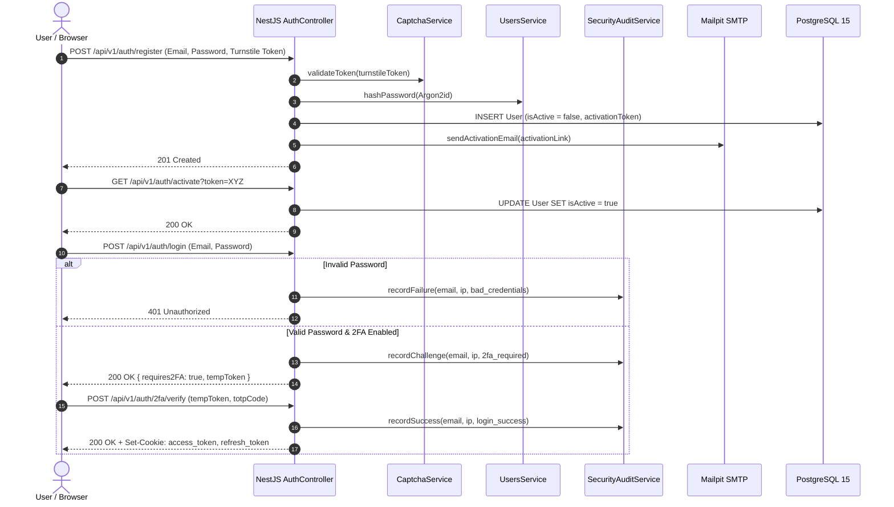

# Authentication & Security Module (`AuthModule`)

The `AuthModule` provides zero-trust identity authentication, multi-factor verification, and session governance for BugTracker.

---

## 1. Authentication Flow Diagram

### Rendered Sequence Diagram

<b>Click to expand Mermaid Source Code</b>

---

## 2. Key Security Mechanisms

### Cryptography & Passwords
* **Argon2id**: Passwords hashed using Argon2id with memory cost 19456 KiB (19 MiB), time cost 2, parallelism 1 (per RFC 9106 recommended profile to eliminate Node.js thread pool starvation under high concurrency).
* **TOTP 2FA (RFC 6238)**: `otplib` generates base32 secret and pairs with authenticator apps (Google Authenticator, Authy).
* **Cloudflare Turnstile**: Client tokens validated via Cloudflare siteverify endpoint in `CaptchaService`.

### Session Management & Distributed Redis Cache
* **Dual-Token Cookie Model**:
  * `access_token`: Short-lived (15 min) JWT containing `{ sub, email, role, tokenVersion }`.
  * `refresh_token`: Long-lived (7 days) signed token.
  * Both cookies set with `httpOnly: true`, `SameSite: Lax`, and `secure` in production.
* **Redis Session Cache (`user:session:${sub}`)**:
  * `JwtStrategy` caches validated user profiles in Redis with 300s TTL, eliminating redundant PostgreSQL queries on every incoming HTTP/WS request.
  * Checks `tokenVersion` against session state; purging the cache key and incrementing `tokenVersion` provides instantaneous global session revocation across all API replicas on logout, password change, deactivation, or role change.

### Brute-Force & Distributed Rate Limiting
* **Database Lockout Forensics**: Tracks consecutive failed login attempts in `User.failedLoginAttempts`. 5 failed attempts trigger a 15-minute account freeze (`User.lockoutUntil`).
* **Redis Sliding-Window Rate Limiter**: `LoginRateLimiterService` enforces distributed IP + email throttling in Redis (`login:failed:${ip}:${email}`) with 15-minute sliding window, returning `429 Too Many Requests` without relying on single-node in-memory state.
* Every attempt emits an audit record via `SecurityAuditService`.

### Distributed OAuth Exchange Store
* Single-use OAuth exchange codes are stored in Redis (`oauth:code:${code}`, 300s TTL) by `OAuthCodeStoreService`, enabling horizontally scaled OAuth redirects across multi-instance clusters.

---

## 3. Primary Endpoints (`/api/v1/auth`)

| Method | Endpoint | Description | Auth Required |
|---|---|---|---|
| `POST` | `/register` | Register new user with password & CAPTCHA | Public |
| `POST` | `/login` | Authenticate with email & password | Public |
| `GET` | `/activate` | Verify single-use account activation token | Public |
| `POST` | `/logout` | Invalidate cookies, evict Redis session cache, and end session | User |
| `POST` | `/forgot-password` | Request password reset token to email | Public |
| `POST` | `/reset-password` | Reset password using verified token | Public |
| `POST` | `/2fa/generate` | Generate TOTP secret and QR code URI | User |
| `POST` | `/2fa/enable` | Confirm TOTP code and enable 2FA | User |
| `POST` | `/2fa/verify` | Complete 2FA login challenge with temp token | Public |
| `GET` | `/github` | Initiate GitHub OAuth2 authorization redirect | Public |
| `GET` | `/github/callback` | GitHub OAuth2 callback | Public |
| `GET` | `/google` | Initiate Google OAuth2 authorization redirect | Public |
| `GET` | `/google/callback` | Google OAuth2 callback | Public |
| `POST` | `/oauth/exchange` | Exchange one-time Redis OAuth code for session cookies | Public |

---

## 4. Key Source Files
* Controller: [`auth.controller.ts`](../../backend/src/modules/auth/auth.controller.ts)
* Service: [`auth.service.ts`](../../backend/src/modules/auth/auth.service.ts)
* JWT Strategy: [`jwt.strategy.ts`](../../backend/src/modules/auth/jwt.strategy.ts)
* Redis Rate Limiter: [`login-rate-limiter.service.ts`](../../backend/src/modules/auth/login-rate-limiter.service.ts)
* Redis OAuth Store: [`oauth-code-store.service.ts`](../../backend/src/modules/auth/oauth-code-store.service.ts)
* Redis Module: [`redis.service.ts`](../../backend/src/modules/redis/redis.service.ts)
* Captcha: [`captcha.service.ts`](../../backend/src/modules/captcha/captcha.service.ts)
