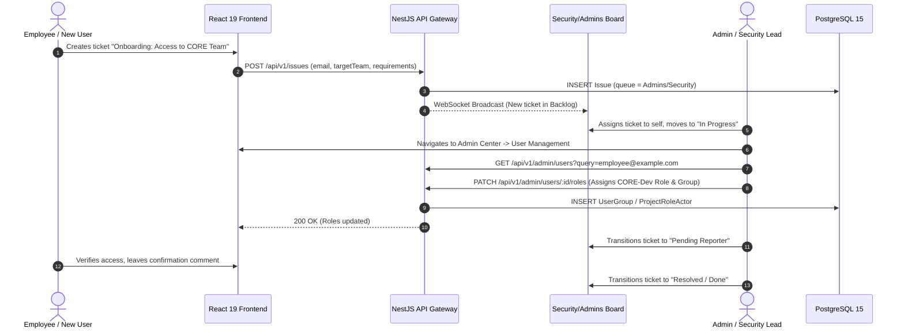

# Role-Based Access Control Module (`RbacModule`)

The `RbacModule` implements enterprise-grade, dual-layer access control inspired by Jira's permission architecture.

---

## 1. Onboarding & RBAC Assignment Workflow

### Rendered Workflow Diagram


<details>
<summary><b>Click to expand Mermaid Source Code</b></summary>


</details>

---

## 2. Dual-Layer Authorization Architecture

```
Layer 1: Global System Roles (User.systemRole)
         ├── ADMIN  (Full platform & tenant authority)
         └── USER   (Standard authenticated user)

Layer 2: Project-Scoped Roles (ProjectRoleActor)
         ├── Project Administrator
         ├── Lead Developer
         └── Member / Contributor
```

### Permission Schemes & Grants
* **PermissionScheme**: Defines reusable permission sets assigned to projects.
* **PermissionGrant**: Maps a granular action (`CREATE_ISSUES`, `EDIT_ISSUES`, `ASSIGN_ISSUES`, `DELETE_ISSUES`, `CLOSE_ISSUES`) to:
  * A Project Role (e.g. `Developer`),
  * A User Group (e.g. `Engineering-CORE`),
  * The Project Lead, or
  * The Current Assignee.

### Issue Security Schemes
* Protects high-confidentiality issues (e.g. zero-day security reports, internal HR tickets).
* Issues assigned an `IssueSecurityLevel` are hidden from users unless they match an `IssueSecurityGrant`.

---

## 3. Primary Endpoints (`/api/v1/rbac`)

| Method | Endpoint | Description | Auth Required |
|---|---|---|---|
| `GET` | `/schemes` | List all permission schemes | Admin (`Roles('ADMIN')`) |
| `POST` | `/schemes` | Create a new permission scheme | Admin (`Roles('ADMIN')`) |
| `GET` | `/groups` | List all user groups | JWT (`JwtAuthGuard`) |
| `POST` | `/groups` | Create an organizational group | Admin (`Roles('ADMIN')`) |
| `POST` | `/groups/:id/members` | Add a user to a group | Admin (`Roles('ADMIN')`) |
| `DELETE` | `/groups/:id/members/:userId`| Remove a user from a group | Admin (`Roles('ADMIN')`) |
| `GET` | `/roles` | List all available project roles | JWT (`JwtAuthGuard`) |

---

## 4. Key Source Files
* Controller: [`rbac.controller.ts`](../../backend/src/modules/rbac/rbac.controller.ts)
* Service: [`rbac.service.ts`](../../backend/src/modules/rbac/rbac.service.ts)
* Entities: [`backend/src/modules/rbac/entities/`](../../backend/src/modules/rbac/entities)
