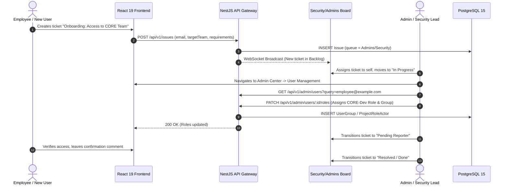

# Role-Based Access Control Module (`RbacModule`)

The `RbacModule` implements enterprise-grade, dual-layer access control inspired by Jira's permission architecture.

---

## 1. Onboarding & RBAC Assignment Workflow

### Rendered Workflow Diagram


<details>
<summary><b>Click to expand Mermaid Source Code</b></summary>


</details>

---

## 2. Dual-Layer Authorization Architecture

```
Layer 1: Global System Roles (User.systemRole)
         ├── ADMIN  (Full platform & tenant authority, immutable root)
         └── USER   (Standard authenticated user)

Layer 2: Project-Scoped Roles (ProjectRoleActor)
         ├── Project Administrator
         ├── Lead Developer
         └── Member / Contributor
```

* **Global System Role**: Pure binary flag (`ADMIN` vs `USER`). All professional disciplines and team job functions (such as Frontend Engineer, QA Lead, DevOps Architect) are decoupled from system authorization and maintained in `User.jobTitle`.
* **Root Administrator Immutability Guarantees**:
  * The designated root administrator account (holding `User.isRoot === true` or matching `INITIAL_ADMIN_EMAIL`) cannot be demoted to `USER` (`403 Forbidden`).
  * The root administrator account cannot be blocked via administrative user controls (`403 Forbidden`).
  * The root administrator account cannot be deleted (`403 Forbidden`).
  * The root administrator account cannot be removed from the `administrators` directory group (`403 Forbidden`).
  * Non-root administrators (promoted accounts holding `SystemRole.ADMIN`) display the `Admin` role, and may be demoted back to `USER`, blocked, or deleted by authorized administrators.

### Permission Schemes & Grants
* **PermissionScheme**: Defines reusable permission sets assigned to projects.
* **PermissionGrant**: Maps a granular action (`CREATE_ISSUES`, `EDIT_ISSUES`, `ASSIGN_ISSUES`, `DELETE_ISSUES`, `CLOSE_ISSUES`, `ADMINISTER_PROJECTS`, `BROWSE_PROJECTS`, `LOG_WORK`, `MANAGE_ATTACHMENTS`) to:
  * A Project Role (e.g. `Administrators`, `Developers`, `Viewers`),
  * A User Group (e.g. `all-users`, `Engineering-CORE`),
  * The Project Lead,
  * The Current Assignee, or
  * The Reporter.

### Default Agile Collaborative Scheme & Auto-Binding
* **Modernized Agile Defaults**: Unlike restrictive legacy permission setups, BugTracker's default system scheme grants:
  * `Developers` and `all-users`: Full issue creation, assignment, transition, and worklog tracking.
  * `Current Assignee`: Unconditional rights to edit, reassign, transition, log work, and resolve their tickets.
  * `Reporter`: Explicit rights to comment, update descriptions, and close tickets they opened.
* **Reporter 24-Hour Grace Period for Deletion**:
  * In the Agile Collaborative Scheme, reporters are empowered to delete accidental tickets within a 24-hour grace window from creation, provided the ticket remains in initial `OPEN` state with 0 logged work hours.
  * Project Administrators and Project Leads retain unconditional deletion rights at all times.
* **Automatic Workspace Auto-Binding**:
  * Upon new project space creation, the creating user is immediately enrolled as an actor in the project's `Administrators` role.
  * The `all-users` system group is bound to `Developers` by default, eliminating mystery 403 permission deadlocks while permitting administrators to tighten access in Project Settings -> Access & Permissions.

### Single-Pass RBAC Evaluation & Redis Caching
* **Single-Pass SQL Optimization**: `PermissionEvaluatorService.getEffectivePermissions(userId, projectId)` queries all effective permissions in a single SQL query joining `projects`, `permission_schemes`, `permission_grants`, `project_role_actors`, and `user_group_memberships`. This completely eliminates the previous 100+ sequential N+1 query loop.
* **Redis Effective Permissions Cache (`rbac:user:${userId}:project:${projectId}`)**:
  * Evaluated permissions are cached with a 300s TTL.
  * Invalidation hooks automatically purge affected user/project keys when project role actors, user groups, or permission schemes are updated.
* **Multi-Tenant Project Isolation**: `PermissionEvaluatorService.getAccessibleProjectIds(userId)` calculates all project IDs a user is authorized to browse, enforcing strict tenant separation across project listing endpoints.

### Fail-Closed Project Permission Guard
* `ProjectPermissionGuard` enforces fail-closed authorization.
* If a project ID cannot be resolved from route parameters (`:projectId`, `:id`), query string (`?projectId=`), request body, or ticket lookup, the guard immediately throws `ForbiddenException('Project context required for permission verification')`.
* This prevents any unauthenticated or ambient privilege escalation bypasses.

### Issue Security Schemes
* Protects high-confidentiality issues (e.g. zero-day security reports, internal HR tickets).
* Issues assigned an `IssueSecurityLevel` are hidden from users unless they match an `IssueSecurityGrant`.

---

## 3. Primary Endpoints (`/api/v1/rbac`)

| Method | Endpoint | Description | Auth Required |
|---|---|---|---|
| `GET` | `/schemes` | List all permission schemes | Admin (`Roles('ADMIN')`) |
| `POST` | `/schemes` | Create a new permission scheme | Admin (`Roles('ADMIN')`) |
| `DELETE` | `/permission-schemes/:id` | Delete a custom permission scheme (safeguards default scheme and projects bound) | Admin (`Roles('ADMIN')`) |
| `GET` | `/groups` | List all user groups | JWT (`JwtAuthGuard`) |
| `POST` | `/groups` | Create an organizational group | Admin (`Roles('ADMIN')`) |
| `DELETE` | `/groups/:id` | Delete an organizational group (safeguards `administrators` directory group) | Admin (`Roles('ADMIN')`) |
| `POST` | `/groups/:id/members` | Add a user to a group | Admin (`Roles('ADMIN')`) |
| `DELETE` | `/groups/:id/members/:userId`| Remove a user from a group (protects root admins) | Admin (`Roles('ADMIN')`) |
| `GET` | `/roles` | List all available project roles | JWT (`JwtAuthGuard`) |
| `POST` | `/roles` | Create a new project role | Admin (`Roles('ADMIN')`) |
| `PUT` | `/roles/:id` | Update project role name, description, or default workspace flag (`isDefault`) | Admin (`Roles('ADMIN')`) |
| `DELETE` | `/roles/:id` | Delete a custom project role (safeguards baseline roles: Administrator, Member, Viewer) | Admin (`Roles('ADMIN')`) |
| `GET` | `/security-schemes` | List all issue security schemes with levels | JWT (`JwtAuthGuard`) |
| `POST` | `/security-schemes` | Create a new issue security scheme (auto-creates default security level) | Admin (`Roles('ADMIN')`) |
| `DELETE` | `/security-schemes/:id` | Delete an issue security scheme (safeguards default scheme and projects bound) | Admin (`Roles('ADMIN')`) |
| `GET` | `/projects/:id/rbac/people` | Retrieve project members and their assigned roles | `ProjectPermission.BROWSE_PROJECTS` |
| `POST` | `/projects/:id/rbac/roles/:roleId/actors` | Assign user or group to project role | `ProjectPermission.ADMINISTER_PROJECTS` |
| `DELETE` | `/projects/:id/rbac/roles/:roleId/actors` | Remove user or group from project role | `ProjectPermission.ADMINISTER_PROJECTS` |

---

## 4. Key Source Files
* Controller: [`rbac.controller.ts`](../../backend/src/modules/rbac/rbac.controller.ts)
* Service: [`rbac.service.ts`](../../backend/src/modules/rbac/rbac.service.ts)
* Permission Evaluator: [`permission-evaluator.service.ts`](../../backend/src/modules/rbac/services/permission-evaluator.service.ts)
* Project Permission Guard: [`project-permission.guard.ts`](../../backend/src/modules/rbac/guards/project-permission.guard.ts)
* Entities: [`backend/src/modules/rbac/entities/`](../../backend/src/modules/rbac/entities)
