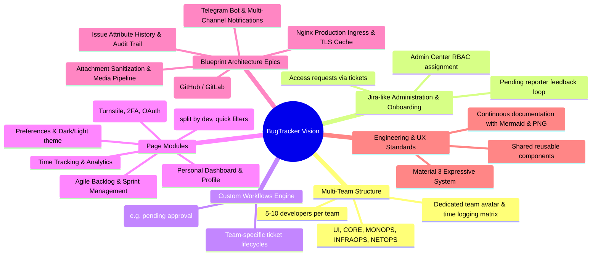

# Product Ideas & Requirements Backlog

This document organizes and structures the core vision, feature ideas, and workflows originating from the project developer's original notes ([`raw_notes.txt`](raw_notes.txt)) as well as the initial system architecture blueprint.

---

## 1. Domain Epics Overview

---

## 2. Feature Backlog Breakdown

### Epic 1: Multi-Team Spaces & Realistic Engineering Data
* **Concept**: Model a realistic tech organization with distinct functional teams supporting the BugTracker platform itself (*dogfooding*):
  * **Teams**: `UI`, `CORE`, `MONOPS`, `INFRAOPS`, `NETOPS`.
  * **Headcount**: 5 to 10 engineers per team.
  * **Inter-team dependencies**: Tickets linked across teams (e.g. `UI` ticket blocked by `CORE` API endpoint).
  * **Team Identity**: Avatars for each team to allow rapid visual recognition across boards and filters.

### Epic 2: Ticket-Driven Access & Onboarding Workflow
* **Concept**: Implement corporate onboarding through the issue tracker rather than ad-hoc emails:
  1. An employee submits an onboarding ticket: *"Access Request: CORE Team"* attaching desired team, email, and username.
  2. The ticket enters the Security/Admins Kanban queue.
  3. An admin assigns the ticket, opens **Admin Center → User Management**, verifies the user, and assigns the appropriate RBAC roles/groups.
  4. The admin transitions the ticket to `PENDING_REPORTER` awaiting confirmation.
  5. The employee verifies access and confirms resolution.

### Epic 3: Custom Team Workflows Engine
* **Concept**: Provide teams with flexible Finite State Machine (FSM) workflows:
  * Default workflow assigned on team creation (`TODO` → `IN_PROGRESS` → `IN_REVIEW` → `DONE`).
  * Team Leads can customize states (e.g., adding `PENDING_APPROVAL`, `QA_VERIFICATION`, or removing `IN_REVIEW` if not needed).

### Epic 4: Application Views & Capabilities
1. **Landing & Public Portal**: Welcoming unauthenticated visitors, presenting core platform advantages, quick links to Sign In / Sign Up.
2. **Auth Flows**: Modern registration with Cloudflare Turnstile, Argon2id passwords, TOTP 2FA pairing via QR code, and Google/GitHub OAuth2.
3. **Team Kanban Board**: Visual status columns, swimlanes/grouping by assignee, quick filters by engineer.
4. **Agile Backlog**: Sprint planning, drag-and-drop ticket prioritization, velocity tracking, backlog refinement.
5. **Personal Dashboard**: Fast jumps to assigned tickets, saved search filters, personal worklog summary.
6. **User Profile**: Active roles, team membership, device session history, profile picture editing, 2FA configuration.
7. **Preferences**: Theme switching (Dark/Light mode), layout toggles (curved sidebar width, density).
8. **Admin Center**: User management, RBAC role grants, system banner management, security audit logs, platform health diagnostics.
9. **Time Tracking Matrix**: Daily/weekly timesheets per team and per developer, worklog entries, estimation accuracy forensics.
10. **Analytics & Reports**: Burndown charts, velocity metrics, lead time, bottleneck detection for managers.

---

## 3. Architecture Evolution Epics (Derived from Initial Blueprint Analysis)

These high-priority epics originate directly from the original architectural blueprint, addressing capabilities designed in the initial vision that remain to be implemented in the active codebase:

### Epic 5: Git Repository Webhook Integration (`GitHub / GitLab Webhooks`)
* **Rationale & Blueprint Context**:  
  The blueprint included external Git triggers feeding into the ingress layer. Currently, GitHub is used exclusively for OAuth2 user authentication, leaving developer repository activity decoupled from issue tickets.
* **Proposed Implementation**:
  1. **Webhook Receiver Endpoint**:
     * Implement `POST /api/v1/webhooks/github` and `/gitlab` with HMAC-SHA256 signature verification (`X-Hub-Signature-256`).
  2. **Smart Commit & PR Parsing**:
     * Extract issue keys via regex matching (e.g., `/(UI|CORE|MON|INFRA|NET)-\d+/i`).
     * Transition triggers: `Fixes CORE-101`, `Closes CORE-101`, or `Resolves CORE-101` automatically transitions the issue to `RESOLVED`.
     * Worklog capture: `Work on CORE-101: 2h 30m` automatically creates a worklog entry linked to the committer's email.
  3. **Frontend Development Panel**:
     * Add a "Development" section to [`IssueDetailPage`](../../frontend/src/pages/IssueDetailPage.tsx) displaying linked branches, pull requests, commit hashes, and CI/CD status badges.

### Epic 6: Immutable Issue Attribute History & Audit Trail (`Audit & History Service`)
* **Rationale & Blueprint Context**:  
  The blueprint featured an *“immutable audit trail of defect attribute changes”* (Незмінний аудитний слід змін атрибутів дефектів). While `SecurityAuditModule` records user authentication forensics, ticket-level changes (status transitions, priority bumps, re-assignments) are currently not versioned.
* **Proposed Implementation**:
  1. **Data Model**:
     * Create `IssueAuditLog` entity: `id`, `issueId`, `authorId`, `fieldName` (e.g., `status`, `priority`, `assigneeId`, `estimateHours`, `title`), `oldValue`, `newValue`, `createdAt`.
  2. **Automatic Mutation Interceptor**:
     * Attach a TypeORM Entity Subscriber (`IssueSubscriber`) or service interceptor that diffs incoming changes in `PATCH /api/v1/issues/:id` and records transactional log entries.
  3. **Visual Change Timeline**:
     * Implement an "Activity / Changelog" tab on [`IssueDetailPage`](../../frontend/src/pages/IssueDetailPage.tsx) showing an audit trail:  
       * *“Alex Mercer changed Status from OPEN to IN_PROGRESS (2 hours ago)”*  
       * *“Sarah Chen reassigned ticket from Unassigned to David Miller (yesterday)”*.

### Epic 7: Multi-Channel Notification Dispatcher (`Telegram Bot API / SMTP Push`)
* **Rationale & Blueprint Context**:  
  The blueprint designed an asynchronous notification engine pushing alerts to both Telegram Bot API and SMTP. Currently, the system only sends transactional authentication emails and ephemeral in-browser WebSocket toasts.
* **Proposed Implementation**:
  1. **Asynchronous Background Queue**:
     * Integrate `@nestjs/bullmq` backed by Redis 7 to process outgoing push dispatches without blocking HTTP request execution.
  2. **Telegram Bot Service (`TelegramNotificationService`)**:
     * Allow users to pair their Telegram account on [`ProfilePage`](../../frontend/src/pages/ProfilePage.tsx) using a deep link token (`https://t.me/BugTrackerBot?start=<LINK_TOKEN>`).
     * Dispatch instant markdown alerts for:
       * Direct ticket assignment (`[ALERT] CRITICAL bug assigned to you: NET-42`).
       * Mentions in comments (`[MENTION] @volodymyr mentioned you in CORE-101`).
       * Onboarding ticket status updates (`[STATUS] Access to team CORE approved`).
  3. **Notification Preferences**:
     * Expand [`PreferencesPage`](../../frontend/src/pages/PreferencesPage.tsx) with a multi-channel matrix enabling users to toggle In-App vs. Email vs. Telegram notifications per category.

### Epic 8: Production Ingress & Edge Proxy (`Nginx Ingress Tier`) `[STATUS: COMPLETED]`
* **Rationale & Blueprint Context**:  
  The blueprint placed an Nginx edge proxy in front of the API gateway to handle TLS 1.3, HTTP/2 multiplexing, rate-limiting, and static caching.
* **Implemented Architecture**:
  1. **Nginx Ingress Service in `docker-compose.prod.yml`**:
     * Runs a hardened multi-stage `nginx:alpine` container (`nginx/Dockerfile.prod`) as the production unified edge ingress (`port 80`).
     * Compiles the React 19 SPA directly into the image for zero-latency static serving with immutable caching (`/assets/`).
  2. **Configuration & Reverse Proxy Topology**:
     * [`nginx/nginx.conf`](../../nginx/nginx.conf): Gzip compression for CSS/JS/SVG/JSON, connection limiter, and Layer 7 IP rate limiting (`limit_req_zone $binary_remote_addr zone=api_limit:10m rate=20r/s;`). 25 MB max body size for attachments.
     * [`nginx/prod.conf`](../../nginx/prod.conf): Routes `/api/` to `http://backend:3000` with standard proxy headers, proxies `/events/` to the WebSocket gateway with `Upgrade` headers, and serves `/` to production static Vite files with HTML5 History fallback (`/index.html`).
  3. **Development Isolation**:
     * Local development remains unburdened by Nginx: developers use Vite's built-in dev proxy and direct host execution (`http://localhost:5173` and `http://localhost:3000`), avoiding host-networking and Linux gateway timeouts.

### Epic 9: Attachment Processing & Security Pipeline (`Attachment Service`)
* **Rationale & Blueprint Context**:  
  The blueprint highlighted file attachment processing as a distinct security boundary requiring MIME validation, 25 MB size caps, and file sanitization.
* **Proposed Implementation**:
  1. **SVG Disinfection**:
     * Sanitize uploaded `.svg` files using DOMPurify to strip embedded `<script>`, `onload`, and foreign XML objects, preventing stored Cross-Site Scripting (XSS).
  2. **Image Optimization & Thumbnails**:
     * Process image uploads through `sharp` to generate 200x200 `.webp` thumbnails, drastically speeding up image preview loading on Kanban boards.
  3. **Pluggable Malware Scanning**:
     * Add an asynchronous ClamAV / VirusTotal scanner hook that verifies binary attachments before marking them active in SeaweedFS S3.

---

## 4. UI/UX Rules from Developer Notes
* **Design Consistency**: Every page must derive from shared tokens and atomic components; no page should recreate custom layouts from scratch.
* **Palette Selection**: Strict use of predefined, high-contrast Material 3 Expressive palettes ($\Delta\text{Tone} \ge 60$ between foreground and background).
* **Architecture Maintenance**: Completed modules must maintain technical documentation accompanied by both Mermaid source and PNG diagrams.
