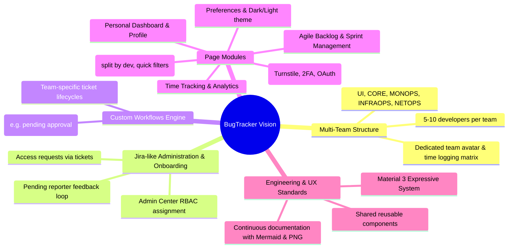

# Product Ideas & Requirements Backlog

This document organizes and structures the core vision, feature ideas, and workflows originating from the project developer's original notes ([`raw_notes.txt`](raw_notes.txt)).

---

## 1. Domain Epics Overview

---

## 2. Feature Backlog Breakdown

### Epic 1: Multi-Team Spaces & Realistic Engineering Data
* **Concept**: Model a realistic tech organization with distinct functional teams supporting the BugTracker platform itself (*dogfooding*):
  * **Teams**: `UI`, `CORE`, `MONOPS`, `INFRAOPS`, `NETOPS`.
  * **Headcount**: 5 to 10 engineers per team.
  * **Inter-team dependencies**: Tickets linked across teams (e.g. `UI` ticket blocked by `CORE` API endpoint).
  * **Team Identity**: Avatars for each team to allow rapid visual recognition across boards and filters.

### Epic 2: Ticket-Driven Access & Onboarding Workflow
* **Concept**: Implement corporate onboarding through the issue tracker rather than ad-hoc emails:
  1. An employee submits an onboarding ticket: *"Access Request: CORE Team"* attaching desired team, email, and username.
  2. The ticket enters the Security/Admins Kanban queue.
  3. An admin assigns the ticket, opens **Admin Center → User Management**, verifies the user, and assigns the appropriate RBAC roles/groups.
  4. The admin transitions the ticket to `PENDING_REPORTER` awaiting confirmation.
  5. The employee verifies access and confirms resolution.

### Epic 3: Custom Team Workflows Engine
* **Concept**: Provide teams with flexible Finite State Machine (FSM) workflows:
  * Default workflow assigned on team creation (`TODO` → `IN_PROGRESS` → `IN_REVIEW` → `DONE`).
  * Team Leads can customize states (e.g., adding `PENDING_APPROVAL`, `QA_VERIFICATION`, or removing `IN_REVIEW` if not needed).

### Epic 4: Application Views & Capabilities
1. **Landing & Public Portal**: Welcoming unauthenticated visitors, presenting core platform advantages, quick links to Sign In / Sign Up.
2. **Auth Flows**: Modern registration with Cloudflare Turnstile, Argon2id passwords, TOTP 2FA pairing via QR code, and Google/GitHub OAuth2.
3. **Team Kanban Board**: Visual status columns, swimlanes/grouping by assignee, quick filters by engineer.
4. **Agile Backlog**: Sprint planning, drag-and-drop ticket prioritization, velocity tracking, backlog refinement.
5. **Personal Dashboard**: Fast jumps to assigned tickets, saved search filters, personal worklog summary.
6. **User Profile**: Active roles, team membership, device session history, profile picture editing, 2FA configuration.
7. **Preferences**: Theme switching (Dark/Light mode), layout toggles (curved sidebar width, density).
8. **Admin Center**: User management, RBAC role grants, system banner management, security audit logs, platform health diagnostics.
9. **Time Tracking Matrix**: Daily/weekly timesheets per team and per developer, worklog entries, estimation accuracy forensics.
10. **Analytics & Reports**: Burndown charts, velocity metrics, lead time, bottleneck detection for managers.

---

## 3. UI/UX Rules from Developer Notes
* **Design Consistency**: Every page must derive from shared tokens and atomic components; no page should recreate custom layouts from scratch.
* **Palette Selection**: Strict use of predefined, high-contrast Material 3 Expressive palettes ($\Delta\text{Tone} \ge 60$ between foreground and background).
* **Architecture Maintenance**: Completed modules must maintain technical documentation accompanied by both Mermaid source and PNG diagrams.
