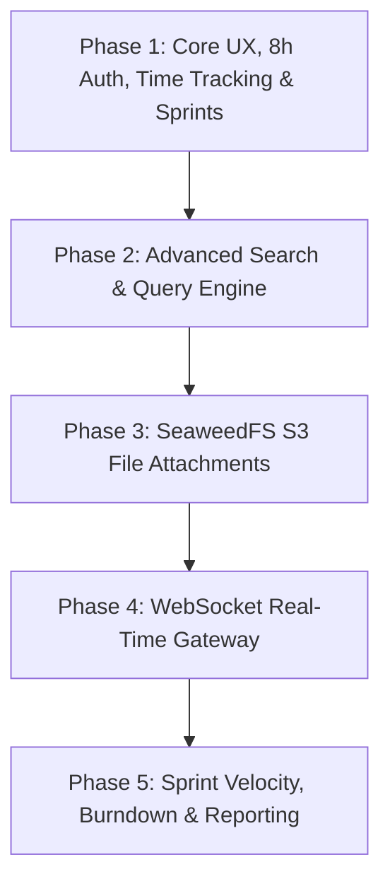

# BugTracker: Advanced Search, Architecture Roadmap & System Evolution Plan

## 1. Executive Summary of Implementations Completed in this Release

Following the user requirements, the system has received major core architectural, UX, and engine upgrades:

### 1.1. Time Logging & Effort Tracking Fixes
- **Root Cause Eliminated:** Removed the strict `min="0.1" step="0.25"` native HTML5 constraints in `LogWorkModal.tsx` which mathematically rejected integers like `1` or `0.5` with browser step-mismatch errors (`"The two nearest valid values are 0.85 and 1.1"`).
- **Dual Hours & Minutes Precision:** Replaced single step input with dual **Hours (0..24, step="any")** and **Minutes (0..59, step="1")** fields.
- **Preset Quick Chips:** Added instant preset chips (`15m`, `30m`, `45m`, `1h`, `1.5h`, `2h`, `4h`, `8h`).
- **Ticket Association:** Made ticket association mandatory and prominent, allowing logging against either the currently open ticket or any active project ticket via a clean selector.
- **Backend Validation Expansion:** Updated `LogWorkDto` `@Min(0.01)` so short tasks (1 to 5 minutes) pass backend validation seamlessly.
- **High-Contrast Calendar Rendering:** Overhauled `TimeCalendar.tsx` day badges with dark-mode luminous tokens and light-mode high-contrast badges (`bg-emerald-600 text-white font-bold`, dark day numbers), ensuring full visibility in both white and dark themes.
- **Unlimited Past Month Navigation:** Fixed calendar and team matrix navigation allowing engineers and managers to browse unlimited past and future months.
- **Team Matrix Whitespace Compression:** Constrained the `Team Member` column in `TimeTrackingPage.tsx` to `w-48 max-w-[200px]` with text truncation, eliminating blank dead space.

### 1.2. Sprint Lifecycle & Ticket Association
- **Sprint Creation Modal:** Added `+ Create Sprint` on `BacklogPage.tsx` supporting custom Sprint Name, Sprint Goal, Start Date, and End Date (defaulting to 2-week agile iterations).
- **Multi-Sprint Management:** Replaced hardcoded single-sprint logic with dynamic multi-sprint buckets (e.g. `Sprint 1`, `Sprint 2`, `Sprint 3`, etc.) alongside `Product Backlog`.
- **Sprint Badge & Assignment on Issue Detail:** Updated `IssueDetailPage.tsx` to prominently show the Sprint Iteration badge in the header, and added a live Sprint Selector in the right attributes card calling `api.updateIssueSprint(issue.id, sprint)` with instant updates.

### 1.3. Advanced Search & Query Builder
- **New Standalone Screen (`/search`):** Created `AdvancedSearchPage.tsx` with full-text search across issue keys, titles, and descriptions.
- **Multi-Select Attribute Filters:** Project, Status, Priority, Severity, Assignee, Sprint, and date sorting.
- **Filter Persistence:** One-click "Save Filter" button that serializes criteria into `SavedFilter` and pins it to the user's dashboard.
- **Data Export:** Integrated one-click CSV export of filtered defect datasets.
- **Direct Navigation:** Added Search route to `App.tsx` and a navigation item in `Sidebar.tsx`.

### 1.4. Navigation & Header Announcements
- **Sidebar Workspace Switcher:** Replaced non-functional select dropdown with an interactive Material 3 workspace switcher menu displaying project keys (`CORE`), names, and active checkmarks.
- **Custom Header Message & Color Picker:** Replaced static enterprise text with an announcement banner supporting 5 customizable themes (`blue`, `amber`, `rose`, `emerald`, `purple`), persistent in `localStorage`.

---

## 2. Priority vs. Severity: Technical Investigation & Recommendation

### 2.1. Theoretical & Industry Context (ISTQB / IEEE 1044 vs Modern Agile)
| Attribute | Traditional QA (IEEE 1044 / ISTQB) | Modern Agile (Linear / GitHub / Modern Jira) |
|---|---|---|
| **Severity** | **Technical Impact:** How much damage the defect causes to system execution, data integrity, or core architecture (Blocker, Major, Minor, Trivial). | Often **omitted or hidden**. Developers prioritize fixing what impacts users or release deadlines first. |
| **Priority** | **Business / Scheduling Urgency:** In which sprint or release the bug must be resolved (Critical, High, Medium, Low). | **Sole Primary Triage Field:** Teams need a single dimension of urgency to avoid triage paralysis. |

### 2.2. The Friction: Why Having Both Causes Confusion
1. **Redundant Decision Fatigue:** When creating an issue, reporters spend unnecessary time wondering whether to mark a bug as "High Priority + Medium Severity" or "Medium Priority + High Severity".
2. **Divergent Expectations:** Developers focus on Priority, while QA focuses on Severity, leading to misaligned expectations during sprint planning.
3. **Edge Case Scenarios:**
   - *High Severity, Low Priority:* A database crash triggered only by an obscure legacy export format used once a year by 1 internal user.
   - *Low Severity, High Priority:* An embarrassing spelling error on the homepage banner or company logo.

### 2.3. Recommended Solution: Option A (Hybrid Smart Default)
- **Make `Priority` the primary, mandatory field** across all simplified creation modals and board views (`CRITICAL`, `HIGH`, `MEDIUM`, `LOW`).
- **Retain `Severity` in the database entity and API for 100% backward compatibility**, but automatically default it to match `Priority`:
  - `Priority: CRITICAL` $
ightarrow$ `Severity: BLOCKER`
  - `Priority: HIGH` $
ightarrow$ `Severity: MAJOR`
  - `Priority: MEDIUM` $
ightarrow$ `Severity: MINOR`
  - `Priority: LOW` $
ightarrow$ `Severity: TRIVIAL`
- Provide an expandable **"Advanced Technical Classification"** accordion in the issue details page for QA engineers who need to override severity independently.

---

## 3. Advanced Search Capabilities: Architectural Execution Plan

### 3.1. Phase 2.1: Client-Side Interactive Query Builder (Completed)
- Instant filtering across title, description, project, sprint, status, priority, and assignee.
- CSV export and saved filter integration.

### 3.2. Phase 2.2: PostgreSQL Full-Text Search Engine (Backend Integration)
- Add a generated `tsvector` column on the `issues` table:
  ```sql
  ALTER TABLE issues ADD COLUMN search_vector tsvector
  GENERATED ALWAYS AS (
    setweight(to_tsvector('english', coalesce(title, '')), 'A') ||
    setweight(to_tsvector('english', coalesce(key, '')), 'A') ||
    setweight(to_tsvector('english', coalesce(description, '')), 'B')
  ) STORED;

  CREATE INDEX issues_search_idx ON issues USING GIN (search_vector);
  ```
- Expose `GET /api/v1/issues/search?q=...&status=...&sprint=...` using `plainto_tsquery` or `phraseto_tsquery` for sub-10ms queries over 100,000+ tickets.

### 3.3. Phase 2.3: Structured Query Language (JQL / Lucene Mode)
- Support structured text syntax in the search bar:
  `project = CORE AND status = IN_PROGRESS AND priority IN (CRITICAL, HIGH) AND assignee = me()`

---

## 4. Multi-Phase Implementation Plan for All Functionality from Previous Labs

To ensure industrial-grade software engineering quality, the implementation is organized into 5 phased milestones:



### Phase 1: Core UX, Auth Hardening, Time Tracking & Sprints (Completed & Verified)
- **Status:** **DONE**
- **Deliverables:**
  - 8-hour JWT token expiration with silent refresh and expiration modals.
  - Interactive personal worklog calendar and team timesheet breakdown matrix.
  - Multi-month navigation controls and high-contrast color scheme.
  - Multi-sprint planning on Backlog page and sprint attributes on tickets.
  - Material 3 Workspace Switcher and custom Announcement Banner.

### Phase 2: Advanced Search, Saved Filters & Sprint Lifecycle (Current Focus)
- **Status:** **IN PROGRESS (Frontend Search completed, Backend FTS planned)**
- **Deliverables:**
  - PostgreSQL GIN full-text search vector indexing.
  - Saved Filters pinned to personal dashboard with real-time issue count badges.
  - Sprint lifecycle controls: "Start Sprint", "Complete Sprint" (with automatic rollover of incomplete tasks to next sprint or backlog).

### Phase 3: File Attachments via SeaweedFS S3-Compatible Storage (Labs 4 & 5)
- **Status:** **PLANNED**
- **Deliverables:**
  - Integration with SeaweedFS S3 container (`localhost:9333`).
  - Attachment entity (`IssueAttachment`: filename, size, mimeType, s3Key, uploaderId).
  - Drag-and-drop file upload zone on Issue Detail page and Kanban cards.
  - Image preview lightbox and error log download.

### Phase 4: WebSocket Real-Time Gateway for Live Collaboration (Labs 4 & 6)
- **Status:** **PLANNED**
- **Deliverables:**
  - NestJS WebSocket Gateway (`@WebSocketGateway({ namespace: '/events' })`).
  - Real-time events: `issue:status_changed`, `issue:assigned`, `worklog:logged`, `comment:created`.
  - Live Kanban board synchronization without page refresh.
  - Collaborative presence indicators ("User X is viewing this issue").

### Phase 5: Agile Analytics, Burndown Charts & Executive Reporting (Labs 2 & 7)
- **Status:** **PLANNED**
- **Deliverables:**
  - Sprint Burndown Chart (Ideal vs Actual effort over sprint duration).
  - Team Velocity Chart (Story points / hours delivered across consecutive sprints).
  - PDF & Excel summary reports generation for project stakeholders.
  - Automated email digests for assigned issues via Mailpit.
