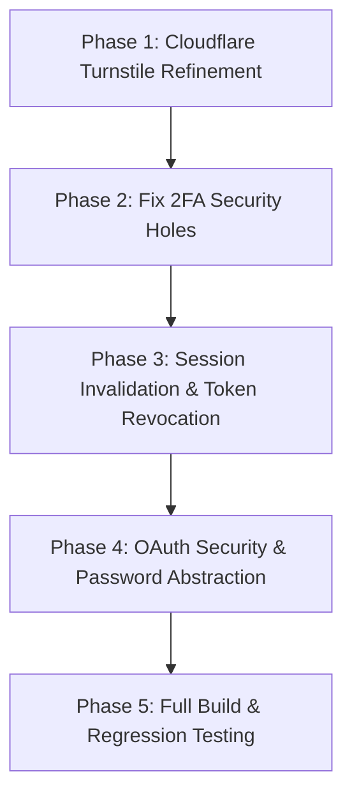

# Authentication System Refinement & Architecture Hardening Plan
**BugTracker v2.0 & SDSecurity Compliance**
*Author:* Antigravity AI Pair Programmer & Volodymyr Fufalko  
*Target Date:* 2026-09-24  
*Location:* `software/info/AUTH_REFINEMENT_AND_SECURITY_HARDENING_PLAN.md`

---

## 1. Executive Summary & Objective

**Status:**
- [x] **Phase 1 (Completed & Verified):** Cloudflare Turnstile `auto` theme migration, eliminating theme reload bug, preserving verified tokens, removing `clipPath` styling hack.
- [x] **Phase 2 (Completed & Verified):** Patched critical 2FA bypass in `JwtStrategy`, protected 2FA secret enrollment with `twoFactorPendingSecret`, implemented token revocation via `tokenVersion`, centralized Argon2id hashing, added unit test suite (12/12 passing).
- [ ] **Phase 3 (Next):** OAuth token transfer hardening (hash fragment / exchange code).

This document defines the comprehensive diagnosis and step-by-step engineering plan to refine the **Authentication System (`AuthModule`)** and its **Cloudflare Turnstile CAPTCHA** integration.

The primary objectives are:
1. **Fix Cloudflare Turnstile Theme-Toggle Reloads:** Eliminate widget destruction and token loss when toggling light/dark themes, preventing spam risks and challenge cycling.
2. **De-obfuscate & Simplify Turnstile Styling:** Remove brittle inline CSS hacks (such as `clipPath: 'inset(1.5px round 6px)'`) in favor of canonical Google Material Design 3 Expressive tokens.
3. **Audit & Remediate `AuthModule` Architectural Flaws:** Resolve critical security vulnerabilities, including 2FA challenge bypass via `tempToken`, premature 2FA secret overwrite, missing token revocation on logout, and token exposure in OAuth callback redirects.

---

## 2. Cloudflare Turnstile: Deep Diagnosis & Solution

### 2.1. Root Cause of the Reload Bug

In `software/frontend/src/components/auth/CaptchaWidget.tsx`:
```tsx
useEffect(() => {
  if (!activeSiteKey) return;
  // ... renders window.turnstile.render(...)
}, [activeSiteKey, action, isDark]); // <-- 'isDark' triggers teardown!
```

1. **Destructive Lifecycle:** Whenever a user toggles between Light and Dark mode in the navbar, `isDark` changes. React runs the cleanup callback:
   - `window.turnstile.remove(currentId);`
   - `containerRef.current.innerHTML = '';`
   - Re-calls `window.turnstile.render(...)` with `theme: isDark ? 'dark' : 'light'`.
2. **Token Invalidation & User Friction:** If the user had already completed the challenge (`status === 'verified'`), tearing down the widget **destroys their valid token**. The user is forced to solve the challenge again.
3. **Spam & Abuse Signal Risk:** Rapid theme toggling causes rapid `remove` and `render` calls to `challenges.cloudflare.com`. Cloudflare's behavioral risk engine can flag this challenge churn as bot behavior, leading to increased failure rates or IP rate-limiting.

### 2.2. Standard Cloudflare Turnstile Practice

According to the [official Cloudflare Turnstile documentation](https://developers.cloudflare.com/turnstile/get-started/client-side-rendering/):
- **`theme: 'auto'` (Default & Recommended):** Turnstile natively detects the visitor's operating system and browser preference via `@media (prefers-color-scheme: dark)` directly inside its iframe.
- **Explicit Lifecycle:** Turnstile does not provide a dynamic `.setTheme()` method. If explicit re-rendering is used, it should **never** be triggered if a valid token is already held.
- **Canonical Setup:** Initialize Turnstile **once** per mount (`theme: 'auto'`). Retain the verified token throughout the component lifecycle until form submission or token expiration (`expired-callback`).

### 2.3. Styling De-obfuscation & Simplification

The previous agent implemented an inline CSS clipping hack:
```tsx
style={isDark ? {
  width: '300px',
  height: '65px',
  overflow: 'hidden',
  clipPath: 'inset(1.5px round 6px)', // <-- Brittle pixel clipping hack!
  borderRadius: '6px',
} : { ... }}
```
- **Flaws:** Hardcoded `clipPath: inset(1.5px)` crops edges off the Cloudflare iframe to hide a 1px border. This breaks subpixel rendering on high-DPI/Retina screens, causes border aliasing, and fails if Cloudflare adjusts internal widget dimensions.
- **Refined Solution:**
  - Remove all `clipPath` declarations.
  - Mount Turnstile in a clean, responsive Material Design 3 container card.
  - Use standard `min-h-[65px]`, `w-full max-w-[300px]`, and centered layout.
  - Integrate smooth transition states, clear status chips, and standard M3 elevation/border tokens.

---

## 3. Comprehensive `AuthModule` Architectural Review

An in-depth audit of `software/backend/src/modules/auth/` and related services uncovered several architectural flaws and security risks:

### 3.1. [CRITICAL] 2FA Bypass Vulnerability via `tempToken`
* **Location:** `software/backend/src/modules/auth/auth.service.ts` (lines 304–313) & `strategies/jwt.strategy.ts`
* **Vulnerability:** When a 2FA-enabled user logs in with their password, `AuthService.login()` issues a 5-minute `tempToken`:
  ```ts
  const tempToken = this.jwtService.sign(
    { sub: user.id, email: user.email, is2faPending: true },
    { expiresIn: '5m' }
  );
  ```
  This token is signed with the **primary `JWT_SECRET`**. However, `JwtStrategy.validate(payload)` only checks `user.id`, `isBlocked`, and `isActivated`—it **never checks `payload.is2faPending`**!
* **Exploit Vector:** An attacker with a user's password receives `tempToken` in the 2FA challenge response and immediately uses it as `Authorization: Bearer <tempToken>` against any protected endpoint (e.g. `/api/v1/users/me`, `/api/v1/projects`). `JwtStrategy` validates it as legitimate, completely bypassing 2FA!
* **Remediation:**
  1. Add an immediate check in `JwtStrategy`:
     ```ts
     if ((payload as any).is2faPending) {
       throw new UnauthorizedException('Two-factor authentication pending. Complete 2FA challenge.');
     }
     ```
  2. Sign 2FA challenge tokens using a dedicated secret (`JWT_2FA_SECRET`) or explicit token type claim (`tokenType: '2fa_challenge'`).

---

### 3.2. [HIGH] Premature Overwrite of `twoFactorSecret`
* **Location:** `software/backend/src/modules/auth/auth.service.ts` (line 388)
* **Vulnerability:** In `generate2faSecret(user)`:
  ```ts
  await this.usersService.update(user.id, { twoFactorSecret: secret });
  ```
  The user's database `twoFactorSecret` is overwritten **immediately when the QR code is generated**, before the user verifies and enables it!
* **Impact:** If a user who already has 2FA enabled clicks "Show QR Code" or opens the settings modal and then closes it without confirming, their active 2FA secret is permanently overwritten with an unconfirmed secret. When they next log in, their authenticator app codes fail, locking them out of their account.
* **Remediation:** Store unconfirmed secrets in a dedicated column `two_factor_pending_secret` (or temporary Redis key with 15-minute TTL). Only promote to `twoFactorSecret` inside `enable2fa()` once the user proves they possess the correct code.

---

### 3.3. [HIGH] Stateless Refresh Tokens Without Revocation (Zombie Sessions)
* **Location:** `software/backend/src/modules/auth/auth.service.ts` & `auth.controller.ts`
* **Vulnerability:** Refresh tokens are signed JWTs with a 7-day expiration. The `POST /auth/logout` endpoint merely returns `{ message: 'Logged out successfully' }` without recording token invalidation or blacklisting.
* **Impact:** If a user logs out on a shared machine, or if a refresh token is leaked, an attacker can continue calling `POST /auth/refresh` to obtain valid access tokens for up to 7 days. Password resets and account compromise recovery cannot terminate existing sessions.
* **Remediation:**
  1. Add `token_version` (integer) to the `User` entity, included in access/refresh token payloads.
  2. Increment `token_version` upon `logout`, `resetPassword`, or `setPassword`.
  3. Alternatively, store active refresh tokens or blacklisted tokens in Redis (`docker-compose` Redis 7 is already active).

---

### 3.4. [MEDIUM] Token Leakage in OAuth Callback URL
* **Location:** `software/backend/src/modules/auth/auth.controller.ts` (lines 201–205, 241–245)
* **Vulnerability:** OAuth callbacks redirect to the frontend with raw tokens in the query string:
  ```ts
  return res.redirect(
    `${frontendUrl}/oauth/callback?accessToken=${encodeURIComponent(tokens.accessToken)}&refreshToken=${encodeURIComponent(tokens.refreshToken)}`
  );
  ```
* **Impact:** Query parameters are recorded in browser history, proxy server access logs, and transmitted via the `Referer` header to external resources loaded on the callback page.
* **Remediation:** Use an authorization exchange code pattern:
  - Backend generates a single-use 60-second exchange code stored in Redis/DB.
  - Redirects to `${frontendUrl}/oauth/callback?code=${exchangeCode}`.
  - Frontend exchanges code via `POST /api/v1/auth/oauth/exchange` over a secure HTTPS/POST body.
  - Alternatively, redirect using URL hash fragments (`#accessToken=...&refreshToken=...`), which are never sent to servers in HTTP requests.

---

### 3.5. [MEDIUM] In-Memory Cache in `AuthService`
* **Location:** `software/backend/src/modules/auth/auth.service.ts` (line 48)
* **Vulnerability:** `private readonly recentlyActivatedTokens = new Map<string, number>();`
* **Impact:** In-memory caching does not scale across multiple backend instances/containers and is lost on process restart.
* **Remediation:** Migrate idempotency checks to Redis with `SET key 1 EX 300 NX`, or check the user's `isActivated` flag directly.

---

### 3.6. [LOW] Duplicated Password Hashing Configurations
* **Location:** `software/backend/src/modules/auth/auth.service.ts` (lines 76, 503, 541)
* **Issue:** Argon2id parameters (`memoryCost: 65536`, `timeCost: 3`, `parallelism: 1`) are hardcoded in three separate places (`register`, `resetPassword`, `setPassword`).
* **Remediation:** Centralize into a helper method:
  ```ts
  private async hashPassword(password: string): Promise<string>
  private async verifyPassword(hash: string, plain: string): Promise<boolean>
  ```

---

## 4. Phased Implementation Roadmap



### Phase 1: Cloudflare Turnstile Refinement (Frontend)
1. **Refactor `CaptchaWidget.tsx`:**
   - Configure Turnstile with official `theme: 'auto'`.
   - Remove `isDark` from the `useEffect` dependencies so the widget renders once and persists.
   - Guard verified state: once verified (`status === 'verified'`), keep the token locked until explicit reset.
   - Remove `clipPath: 'inset(1.5px round 6px)'` and replace with a clean, centered Material Design 3 container card.
2. **Verify Frontend Build:** `cd software/frontend && npm run build`.

### Phase 2: Fix 2FA Security Holes (Backend)
1. **Patch `JwtStrategy`:** Reject any token where `is2faPending === true`.
2. **Secure 2FA Secret Enrollment:**
   - Add `two_factor_pending_secret` column to `User` entity (nullable).
   - In `generate2faSecret`, store secret in `twoFactorPendingSecret`.
   - In `enable2fa`, verify code against `twoFactorPendingSecret`, promote to `twoFactorSecret`, set `twoFactorEnabled = true`, and clear `twoFactorPendingSecret`.

### Phase 3: Session Invalidation & Token Revocation (Backend)
1. **Add `tokenVersion` to `User` Entity:**
   - Include `tokenVersion` in JWT payloads.
   - In `JwtStrategy` and `refreshTokens`, verify that the token's version matches `user.tokenVersion`.
   - In `logout`, increment `user.tokenVersion` to immediately invalidate all existing refresh and access tokens.

### Phase 4: Clean Up Hashing & OAuth Callback
1. **Centralize Argon2id:** Consolidate password hashing and verification into reusable methods in `AuthService`.
2. **OAuth Callback Hardening:** Use URL hash fragments (`#accessToken=...`) or exchange code to prevent token leakage in query strings.

### Phase 5: Verification & Testing
1. **Backend Tests:** Run Vitest suite (`npm test`).
2. **Backend & Frontend Compiles:** Verify zero TypeScript or build errors in both workspaces.
3. **Interactive User Testing:** Provide clear manual testing steps for light/dark Turnstile toggling and auth workflows.

---

## 5. Architectural Quality Matrix

| Dimension | Current State | Target Hardened State |
| :--- | :--- | :--- |
| **Turnstile Theme Switching** | Widget destroyed & re-rendered on every theme toggle; verified token lost | Single stable render using `theme: 'auto'`; verified token preserved |
| **Turnstile Container Styling** | Fragile `clipPath: inset(1.5px)` hack | Clean Material Design 3 container card without clipping hacks |
| **2FA Challenge Security** | `tempToken` accepted by `JwtStrategy` (2FA bypass!) | `JwtStrategy` rejects `is2faPending` tokens; distinct token validation |
| **2FA Secret Enrollment** | Active secret overwritten before confirmation | Dedicated `twoFactorPendingSecret` confirmed before activation |
| **Session Invalidation (Logout)** | No-op; refresh tokens valid for 7 days | `tokenVersion` or Redis revocation; instant session termination |
| **OAuth Token Delivery** | Raw tokens exposed in URL query parameters | Hash fragment or exchange code preventing log leakage |
| **Password Hashing** | Duplicated across 3 methods | Centralized, DRY `hashPassword()` service helper |
