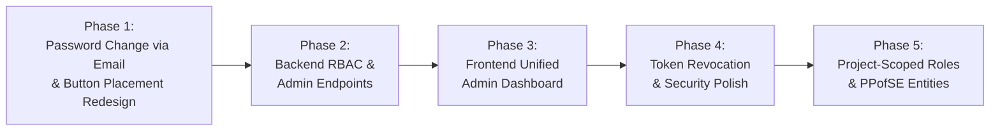

# SDSecurity Lab 6 Compliance Audit, RBAC Architecture & Admin Dashboard Implementation Plan

This document provides a thorough audit of the **SDSecurity Lab 6** («Розробка безпечної системи управління обліковими записами», 15 points) implementation within the Bug / Issue Tracking System, identifies remaining gaps, synthesizes the **Role-Based Access Control (RBAC)** model from **PPofSE Labs 1–5**, and outlines an actionable implementation plan.

---

## 1. Executive Summary & Context Alignment

The Bug / Issue Tracking System project serves as the unifying software engineering foundation across two academic disciplines:

```
┌────────────────────────────────────────────────────────────────────────┐
│                        BugTracker (PPofSE Variant 16)                  │
├──────────────────────────────────┬─────────────────────────────────────┤
│  SDSecurity Lab 6 (Security)     │  PPofSE Labs 1–7 (Software Eng.)    │
│  • Task 1: Complex Passwords     │  • Lab 1: Domain Analysis & Scope   │
│  • Task 2: CAPTCHA Defense       │  • Lab 2: FR-01..FR-13 & Use Cases  │
│  • Task 3: Email Activation      │  • Lab 3: UML (Use Case, Class)     │
│  • Task 4: Lockout & Audit Logs  │  • Lab 4: C4 Architecture & NFRs    │
│  • Task 5: 2FA TOTP & Challenge  │  • Lab 5: PostgreSQL 3NF Schema     │
│  • Task 6: Multi-OAuth2 Identity │  • Lab 6–7: Frontend SPA & Usability│
│  • Task 7: Password Reset Flow   │  • Lab 7+: Projects & Issue FSM     │
└──────────────────────────────────┴─────────────────────────────────────┘
```

At this moment, the authentication and cryptographic core (Argon2id, TOTP, multi-OAuth, token activation, lockout, and password reset) is **fully functional**. However, the **RBAC model** and **Admin Dashboard** currently exist in a minimal state and require expansion to satisfy the requirements of both courses.

---

## 2. SDSecurity Lab 6 Audit Matrix

Below is a detailed verification matrix evaluating all 7 required tasks of SDSecurity Lab 6 against the active codebase:

| Task # | Lab 6 Requirement | Current Implementation Status | Backend Artifacts | Frontend UI Artifacts | Verification & Demonstration Proof |
| :--- | :--- | :---: | :--- | :--- | :--- |
| **Task 1** | **Registration & Password Policy**<br>• Min 8 chars, upper, lower, digit, symbol<br>• Argon2id / bcrypt hashing<br>• User profile & logout | **100% Implemented** | • `register.dto.ts` (Regex validation)<br>• `auth.service.ts` (Argon2id with salt/memory parameters)<br>• `GET /api/v1/users/me`<br>• `POST /api/v1/auth/logout` | • `RegisterPage.tsx`<br>• `PasswordStrengthMeter.tsx` (5 criteria chips)<br>• `ProfilePage.tsx`<br>• `Navbar.tsx` (Logout flow) | **Fully Verified & Satisfied:** Argon2id hash storage, dynamic strength meter, profile viewing, and server-side logout endpoint with client token cleanup. |
| **Task 2** | **Bot Protection (CAPTCHA)**<br>• Validated during registration<br>• Prevents automated account creation | **100% Implemented** | • `captcha.service.ts`<br>• `register.dto.ts` (`captchaToken`) | • `CaptchaWidget.tsx`<br>• Integrated in `RegisterPage.tsx` | **Fully Verified & Satisfied:** Official Cloudflare Turnstile integration (Site Key `0x4AAAAAAFBDW7LqZnzsV119`), server-side `/siteverify` validation, dynamic light/dark theme, fail-closed in production. |
| **Task 3** | **Email Account Activation**<br>• Single-use cryptographic token (24h)<br>• One-click email activation link<br>• `is_activated` status flag | **100% Implemented** | • `POST /auth/register` (Token gen)<br>• `MailerService` (Mailpit SMTP 1025)<br>• `GET /auth/activate?token=...` | • `ActivatePage.tsx`<br>• Confetti celebration animation<br>• Status badge in `ProfilePage.tsx` | **Fully Verified & Satisfied:** 24h crypto token dispatched via Mailpit (`http://localhost:8025`). Inactive users blocked until token clicked. |
| **Task 4** | **Brute-Force Lockout & Audit Logs**<br>• 5 failed attempts &rarr; 15m lockout<br>• `login_audit_logs` tracking IP/UA<br>• Admin forensic controls | **100% Implemented** | • `auth.service.ts` (lockout logic)<br>• `login-audit-log.entity.ts`<br>• `GET /admin/security/login-logs`<br>• `PATCH /users/:id/block` & `unblock` | • `LoginPage.tsx` (live countdown timer)<br>• `AdminDashboardPage.tsx` (Audit logs tab + User table action buttons) | **Fully Verified & Satisfied:** Account locked after 5 bad attempts for 15 min; live countdown in UI; all attempts logged with IP and UA; Admin can view logs and block/unblock. |
| **Task 5** | **Two-Factor Authentication (2FA)**<br>• RFC 6238 TOTP via `otplib`<br>• QR code scan via Google Authenticator<br>• Login challenge prompt | **100% Implemented** | • `POST /auth/2fa/generate`<br>• `POST /auth/2fa/enable`<br>• `POST /auth/2fa/disable`<br>• `POST /auth/2fa/verify` | • `TwoFactorModal.tsx` (QR render + TOTP input)<br>• `LoginPage.tsx` (2-step challenge)<br>• `ProfilePage.tsx` (enable/disable toggle) | **Fully Verified & Satisfied:** RFC 6238 TOTP with QR code generation for Google Authenticator/Authy, 2-step login modal, and admin emergency 2FA reset capability. |
| **Task 6** | **External Identity Providers (OAuth2)**<br>• GitHub & Google OAuth2<br>• Account linking / provisioning<br>• OAuth account password creation | **100% Implemented** | • `github.strategy.ts`<br>• `google.strategy.ts`<br>• `POST /auth/set-password`<br>• `POST /auth/oauth/mock` | • `LoginPage.tsx` (GitHub & Google buttons)<br>• `OAuthCallbackPage.tsx`<br>• `ProfilePage.tsx` (Set password card) | **Fully Verified & Satisfied:** Multi-provider OAuth2 federation (GitHub, Google), account auto-provisioning, and dual-login support (setting password on OAuth accounts). |
| **Task 7** | **Password Recovery / Change Flow**<br>• 15-minute reset token via email<br>• Enforces password complexity<br>• Clears account lockout | **100% Implemented** | • `POST /auth/forgot-password`<br>• `POST /auth/reset-password`<br>• Reset URL directed to Frontend SPA | • `ForgotPasswordPage.tsx`<br>• `ResetPasswordPage.tsx`<br>• `ProfilePage.tsx` (M3 email dispatch card) | **Fully Verified & Satisfied:** 15-minute cryptographic token dispatched to Mailpit inbox; SPA reset form with live password strength meter; successfully clears account lockout. |

---

## 3. Detailed Gap Analysis: What is Missing?

From the audit above and the user's specific feedback, four major functional areas require immediate development:

### Gap 1: Role-Based Access Control (RBAC) is Incomplete

1. **Current State:**
   - In `user.entity.ts`, `systemRole` is limited to:
     ```typescript
     export enum SystemRole {
       ADMIN = 'ADMIN',
       USER = 'USER',
     }
     ```
   - Only the first registered user is granted `ADMIN`, and all subsequent accounts default to `USER`.
   - There is **no API endpoint** to update a user's role (`PATCH /api/v1/users/:id/role`).
   - There is **no UI** allowing an Administrator to promote or reassign user roles.

2. **PPofSE Lab Requirements (Labs 1–5):**
   - In **PPofSE Lab 2 (FR-02)**, **Lab 3 (Class Diagram)**, and **Lab 5 (SQL Schema)**, access control is structured into a **Two-Tier RBAC Architecture**:
     * **Tier 1: Global System Roles (`SystemRole`):**
       - `ADMINISTRATOR`: Global platform configuration, user administration, role assignment, project creation, forensic audit inspection.
       - `USER`: Base platform user with authenticated access to assigned projects and personal profile.
     * **Tier 2: Project-Scoped Roles (`ProjectRole`):**
       - Defined in `Lab5/sql/schema.sql` under table `project_members`:
         - `LEAD` / `PROJECT_MANAGER`: Full project configuration, triage incoming issues, adjust severity/priority, assign issues to developers, milestone scheduling.
         - `DEVELOPER`: Work on assigned issues, transition issue FSM to `IN_PROGRESS` and `RESOLVED` / `PENDING_REPORTER`, link Git commits and branches.
         - `QA` / `REPORTER`: File bug reports, upload attachments and crash logs, verify fixes, transition issue FSM to `CLOSED` or `REOPENED`.
         - `VIEWER`: Read-only stakeholder access to issue boards, Kanban views, and project metrics.

### Gap 2: Admin Dashboard is Limited to Audit Logs

1. **Current State:**
   - The route `/admin/security-logs` loads `AdminSecurityAuditPage.tsx`.
   - It only displays raw rows from `login_audit_logs` and an inline "Block User" button for audit logs that have an associated `userId`.

2. **Missing Functionality for a Complete Admin Dashboard:**
   - **Dedicated User Management View:**
     - Display all registered users (`GET /api/v1/users`) in a paginated, filterable table.
     - Search users by name or email.
     - Filter users by Role (`ADMIN`, `USER`), Status (`Active`, `Pending Activation`, `Blocked`), Auth Provider (`LOCAL`, `GITHUB`, `GOOGLE`), and 2FA status.
     - **Role Assignment Dialog / Dropdown:** Ability for an Admin to promote/demote users (`ADMIN` &harr; `USER`).
     - **Direct Administrative Actions:** Block / Unblock account, Resend activation email, Reset 2FA for users locked out of authenticator apps.
   - **High-Level Security & System Analytics Cards:**
     - Total Accounts, Active Users, Blocked/Suspended Users.
     - 2FA Adoption Rate percentage.
     - Failed Login Attempts (24h) vs Successful Logins.
   - **Infrastructure Health Indicators:**
     - Connectivity status indicators for PostgreSQL (5432), Redis (6379), Mailpit SMTP (1025), and S3/SeaweedFS (8333).

### Gap 3: Server-Side Token Revocation on Logout (Task 1 Polish)

1. **Current State:**
   - Frontend `logout()` removes `accessToken` and `refreshToken` from `localStorage`.
   - The backend does not maintain a revocation registry for issued refresh tokens.

2. **Target State:**
   - Provide `POST /api/v1/auth/logout`.
   - Revoke the user's refresh token in Redis (or database blacklist) so it cannot be used again even if intercepted.

### Gap 4: Password Change Must Be Through Email (SDSecurity Lab 6 - Task 7)

1. **Lab 6 Requirement («Завдання 7 (2 бали): Відновлення/зміна паролю»):**
   - «Користувач надсилає запит на відновлення/зміну паролю, вказуючи свій email.»
   - «Сервер генерує унікальне одноразове посилання (токен) з обмеженим терміном дії (15 хвилин) і надсилає його на вказаний email.»
   - «Користувач переходить за посиланням з email, вводить новий пароль (з перевіркою складності) і підтверджує зміну.»
   - «Після успішної зміни паролю, якщо акаунт був заблокований, блокування знімається.»

2. **Discrepancy in Current Implementation:**
   - Currently, `ProfilePage.tsx` implements an in-place modal/form asking for `Current Password` and `New Password` directly via `POST /api/v1/auth/set-password`.
   - **Why this is a gap**: This completely bypasses the email dispatch loop, failing to demonstrate the 15-minute token generation, email dispatch to Mailpit, and token consumption required for the Lab 6 video demonstration.
   - **Required Behavior**:
     * For **existing password users**, clicking "Change Password" must trigger the **email reset workflow** (`POST /api/v1/auth/forgot-password`).
     * A secure token link is delivered to Mailpit (`http://localhost:8025`).
     * The user clicks the link to open `/reset-password?token=...`, enters their new password with real-time complexity validation, and confirms the change.
     * (Setting an *initial* password on an OAuth-only account with `hasPassword: false` can still be done directly on onboarding, or also supported via email).

### Gap 5: Change Password Button Placement & UI Ergonomics

1. **Current Visual Defect (as observed in user screenshot):**
   - The "Change Password" button currently sits isolated in the middle/bottom of the "Account Password" card.
   - When the user already has `Password Set` (CONFIGURED), the presence of a prominent standalone button without clear context (whether it sends an email or changes in-place) creates visual imbalance against the adjacent "Two-Step Verification" card.

2. **Proposed UI Placement Redesign:**
   - **Option 1 (Email Action Pill inside Card):** Redesign the Account Password card:
     - Show clear credential status: *"Secured with Argon2id cryptographic hash"*.
     - Action button clearly labeled: **"Send Password Reset Link via Email"** (with Mail / Key icon).
     - When clicked, immediately dispatches the token, displays an inline success banner with a quick shortcut to Mailpit in development mode (`Open Mailpit Inbox (8025)`).
   - **Option 2 (Header Action Menu / Modal):** Move credential management into a dedicated "Security Settings" or "Account Actions" dialog to reduce card clutter.

---

## 4. RBAC Permission Matrix (Synthesized from PPofSE Labs)

### 1. Two-Tier Role Hierarchy

```mermaid
graph TD
    subgraph Tier 1: Global Platform Roles
        Admin[Administrator<br>SystemRole.ADMIN]
        User[Standard User<br>SystemRole.USER]
    end

    subgraph Tier 2: Project-Scoped Roles (per ProjectMember)
        Lead[Project Manager / Tech Lead<br>ProjectRole.LEAD]
        Dev[Software Engineer<br>ProjectRole.DEVELOPER]
        QA[Quality Assurance Engineer<br>ProjectRole.QA]
        Viewer[Stakeholder / Viewer<br>ProjectRole.VIEWER]
    end

    Admin -->|Can manage all| User
    Admin -->|Can assign any| Lead
    Admin -->|Can assign any| Dev
    Admin -->|Can assign any| QA
    Admin -->|Can assign any| Viewer
    User -->|Enrolled in projects as| Lead
    User -->|Enrolled in projects as| Dev
    User -->|Enrolled in projects as| QA
    User -->|Enrolled in projects as| Viewer
```

### 2. Global Actions vs System Roles

| Functional Area | Operation | Required System Role | Controller / Guard |
| :--- | :--- | :---: | :--- |
| **Authentication** | Register, Login, 2FA, OAuth, Reset Password | Public / Any User | `AuthController` |
| **Profile** | View Profile, Change Password, Toggle 2FA | Authenticated User | `UsersController.getProfile`, `JwtAuthGuard` |
| **User Directory** | View all users list (`GET /api/v1/users`) | `ADMIN` | `RolesGuard(@Roles('ADMIN'))` |
| **Account Control** | Block / Unblock user (`PATCH /users/:id/block`) | `ADMIN` | `RolesGuard(@Roles('ADMIN'))` |
| **Role Modification**| Change system role (`PATCH /users/:id/role`) | `ADMIN` | `RolesGuard(@Roles('ADMIN'))` *(To Implement)* |
| **Audit Center** | Inspect `login_audit_logs` | `ADMIN` | `SecurityAuditController` |
| **Project Creation**| Create new Project workspace | `ADMIN` (or Lead) | `ProjectsController` *(PPofSE Milestone)* |

### 3. Issue Lifecycle FSM Permissions (PPofSE Lab 2 & Lab 4)

| FSM State Transition | Permitted Project Roles | Business Justification (PPofSE Lab 2) |
| :--- | :---: | :--- |
| `New` &rarr; `Assigned` (Triage) | `LEAD`, `ADMIN` | `UC-02`: Project Manager sets priority (P1..P4) and selects developer Assignee. |
| `Assigned` &rarr; `In Progress` | `DEVELOPER` (Assignee), `LEAD` | `UC-03`: Developer marks work started and records technical plan. |
| `In Progress` &rarr; `Pending Reporter` | `DEVELOPER` (Assignee) | `UC-03`: Developer provides Git commit SHA, build version, and requests QA retest. |
| `Pending Reporter` &rarr; `Closed` | `QA` (Reporter), `LEAD` | `UC-04`: QA verifies resolution in test environment and closes issue. |
| `Pending Reporter` &rarr; `Reopened` | `QA` (Reporter), `LEAD` | `UC-04`: QA identifies recurring defect and returns ticket with required comment. |
| Create Issue / Attach Files | `QA`, `LEAD`, `DEVELOPER` | `UC-01`: Standard defect reporting. |
| Delete Issue / Archive Project | `ADMIN`, `LEAD` | High-privilege administrative action. |

---

## 5. Target Admin Dashboard Wireframe & Layout

The current `/admin/security-logs` route will be upgraded into a unified **Admin Dashboard** (`/admin/dashboard` or `/admin`):

```
┌─────────────────────────────────────────────────────────────────────────────────────────┐
│ BugTracker Admin Center                                     [Theme] [Profile] [Logout]  │
├─────────────────────────────────────────────────────────────────────────────────────────┤
│ ┌───────────────┐ ┌───────────────┐ ┌───────────────┐ ┌───────────────┐ ┌─────────────┐ │
│ │  Total Users  │ │ Active Users  │ │ Blocked Users │ │ 2FA Adoption  │ │ Security Log│ │
│ │      24       │ │      22       │ │       2       │ │     75%       │ │ 152 Events  │ │
│ └───────────────┘ └───────────────┘ └───────────────┘ └───────────────┘ └─────────────┘ │
├─────────────────────────────────────────────────────────────────────────────────────────┤
│ [ Tab: User Management & RBAC ]  [ Tab: Security Audit Logs ]  [ Tab: System Health ]   │
├─────────────────────────────────────────────────────────────────────────────────────────┤
│ Search: [ Filter by name / email... ]   Status: [ All ▼ ]   Role: [ All ▼ ]  Provider:.. │
├─────────────────────────────────────────────────────────────────────────────────────────┤
│ ID  │ User                │ Email               │ Role       │ Auth   │ 2FA │ Status    │ Actions │
├─────┼─────────────────────┼─────────────────────┼────────────┼────────┼─────┼───────────┼─────────┤
│ #1  │ Volodymyr Fufalko   │ v.fufalko@test.com  │ ADMIN    ▼ │ GITHUB │  ✓  │ Active    │ [Block] │
│ #2  │ Jane Smith (Dev)    │ j.smith@dev.local   │ USER     ▼ │ LOCAL  │  ✓  │ Active    │ [Block] │
│ #3  │ Suspicious User     │ bot@attack.ru       │ USER     ▼ │ LOCAL  │  ✗  │ BLOCKED   │ [Unblock]
│ #4  │ Alex QA             │ alex.qa@test.com    │ USER     ▼ │ GOOGLE │  ✓  │ Pending   │ [Activate]
└─────┴─────────────────────┴─────────────────────┴────────────┴────────┴─────┴───────────┴─────────┘
```

---

## 6. Actionable Implementation Plan

The implementation is broken down into structured, verifiable phases, prioritizing the immediate Lab 6 Task 7 email requirement and Profile UI ergonomics:



### Phase 1: Password Change via Email & Profile UI Redesign (SDSecurity Task 7 & UI Ergonomics)

1. **Backend Reset URL Alignment:**
   - In `auth.service.ts` (`forgotPassword` method), fix the reset URL link to direct to the frontend Single Page Application:
     ```typescript
     const frontendUrl = this.configService.get<string>('FRONTEND_URL', 'http://localhost:5173');
     const resetUrl = `${frontendUrl}/reset-password?token=${resetToken}`;
     ```
   - Ensures clicking the email link in Mailpit opens the interactive client view `/reset-password?token=...` rather than hitting a raw backend API endpoint.

2. **Email-Based Password Change Flow in Profile:**
   - In `ProfilePage.tsx`, for accounts where a password is configured (`user.hasPassword === true`):
     - Replace the direct in-place password modification form with the **Lab 6 Task 7 email workflow**.
     - Clicking the action button invokes `api.forgotPassword(user.email)`.
     - Displays an instant, animated M3 notification banner:
       * **Success Message:** `"Password change link sent to devfinkord@gmail.com (expires in 15 minutes)."`
       * **Direct Action:** Quick button to open Mailpit inbox: `[Open Mailpit Inbox (8025) ↗]`.
     - The user opens the email in Mailpit, clicks the one-time 15-minute token link, navigates to `/reset-password?token=...`, validates password complexity via `PasswordStrengthMeter`, and confirms the change.
   - For accounts created via OAuth without a password (`user.hasPassword === false`), preserve the initial password creation form so the user can easily set their first password.

3. **Profile Card Button Placement & Ergonomics Redesign:**
   - Redesign the "Account Password" card layout in `ProfilePage.tsx` using Material Design 3 guidelines:
     - Eliminate the isolated, full-width centered button floating awkwardly below the description.
     - Add a structured **Card Footer / Action Bar** separated by a subtle divider (`border-t border-[var(--md-sys-color-outline-variant)]/40`):
       * **Left / Start:** Security indicator showing destination email (`devfinkord@gmail.com`) and 15-minute token validity note.
       * **Right / End:** Properly proportioned M3 button (`m3-btn-tonal` or `m3-btn-outline` with `Mail` + `KeyRound` icons): `"Send Password Reset Email"`.
     - Equalize the vertical height and card proportions to align cleanly with the neighboring "Two-Step Verification" card.
     - Verify clean responsive stacking on mobile viewports.

---

### Phase 2: Backend RBAC & User Management Expansion

1. **Role Update Endpoint:**
   - Create `UpdateUserRoleDto` validating `@IsEnum(SystemRole)`.
   - In `users.controller.ts`, add `PATCH /api/v1/users/:id/role` guarded by `@Roles(SystemRole.ADMIN)`.
   - Prevent an Administrator from demoting their own account (self-lockout prevention).
2. **User Search & Filtering:**
   - Enhance `UsersService.findAll(page, limit, search?, role?, isBlocked?, isActivated?)`.
   - Support case-insensitive `ILIKE` search across `fullName` and `email`.
3. **Admin Direct Account Activation:**
   - Add `PATCH /api/v1/users/:id/activate` (allows Admin to bypass email link if needed for manual provisioning).
4. **Admin 2FA Reset:**
   - Add `PATCH /api/v1/users/:id/reset-2fa` to allow Admins to restore accounts when users lose their TOTP device.

---

### Phase 3: Frontend Unified Admin Dashboard Implementation

1. **Admin Dashboard Layout Component (`AdminDashboardPage.tsx`):**
   - Replace the standalone audit page with a tabbed dashboard:
     - **Tab 1: User Directory & RBAC Management:**
       - Search bar + status & role filter chips.
       - Interactive user table with role dropdown (`ADMIN` / `USER`).
       - Quick action buttons: Block, Unblock, Reset 2FA, Activate.
       - Role change confirmation dialog.
     - **Tab 2: Security & Forensic Audit Trail:**
       - The existing rich `login_audit_logs` table with status badges (`SUCCESS`, `FAILED_PASSWORD`, `ACCOUNT_LOCKED`, `TWO_FACTOR_FAILED`).
       - Filter by event type and search by IP address.
     - **Tab 3: System Health Overview:**
       - Live service status cards (API, PostgreSQL, Redis, Mailpit, SeaweedFS).
2. **Client API Methods (`api/client.ts`):**
   - Add `updateUserRole(id: number, role: 'ADMIN' | 'USER')`.
   - Add `adminActivateUser(id: number)`.
   - Add `adminResetUser2Fa(id: number)`.
   - Add search and filter params to `getUsers()`.
3. **Navigation & Routes (`App.tsx`):**
   - Update `/admin` and `/admin/dashboard` routes to point to the new unified `AdminDashboardPage`.

---

### Phase 4: Token Revocation & Security Polish (Task 1 Complete)

1. **Server-Side Logout (`POST /api/v1/auth/logout`):**
   - Add logout endpoint receiving refresh token or user context.
   - Blacklist active refresh tokens in Redis / database table to prevent replay attacks.
2. **Frontend Logout Update:**
   - Call `api.logout()` before purging client `localStorage`.

---

### Phase 5: Project-Scoped Roles (PPofSE Integration Milestone)

1. **TypeORM Entities:**
   - Implement `Project` entity (`projects` table) with `key`, `name`, `leadId`.
   - Implement `ProjectMember` entity (`project_members` table) with composite primary key `(projectId, userId)` and enum `projectRole: LEAD | DEVELOPER | QA | VIEWER`.
2. **Project Membership Controller & RBAC Guard:**
   - Create `@ProjectRoles(ProjectRole.LEAD, ProjectRole.DEVELOPER)` decorator and `ProjectRolesGuard`.
   - Allow Project Leads to invite team members and assign project roles.

---

## 7. Verification Checklist

When each phase is completed, verify via:

- [x] **Password Change via Email Dispatch:** From `/profile`, click "Send Password Reset Email"; verify HTTP 200 from `POST /api/v1/auth/forgot-password` and instant UI confirmation banner.
- [x] **Mailpit Token Delivery:** Inspect Mailpit at `http://localhost:8025`; confirm email received with a 15-minute token link leading to `http://localhost:5173/reset-password?token=...`.
- [x] **Password Reset Execution:** Follow link to `/reset-password?token=...`; verify `PasswordStrengthMeter` dynamically validates complexity (8+ chars, upper, lower, digit, symbol); submit new password.
- [x] **Relogin Verification:** Log out and verify successful login using the newly configured password; confirm old password is rejected.
- [x] **Profile Card Ergonomics & Placement:** Inspect `/profile` on desktop (`1440px`) and mobile (`390px`); verify balanced card heights, clean action footer alignment, and Material 3 design consistency.
- [x] **Role Management API:** Verify `PATCH /api/v1/users/:id/role` via Swagger as Admin; verify rejection (HTTP 403) when invoked by a standard `USER`.
- [x] **Admin Self-Demote Guard:** Verify that an Admin attempting to demote themselves receives HTTP 400 (`"Cannot demote your own administrator account"`).
- [x] **Admin Dashboard UI:** Inspect `/admin/dashboard` in both Light and Dark themes.
- [x] **Role Promotion Flow:** Promote a user from `USER` to `ADMIN` in the UI; verify immediate reflection in the table and database.
- [x] **Block & Unblock Flow:** Block a user from the Admin dashboard; verify they cannot log in (HTTP 401 `"Account blocked by administrator"`). Unblock and verify login succeeds.
- [x] **Audit Trail Sync:** Verify that role updates and block/unblock actions record audit log entries.
