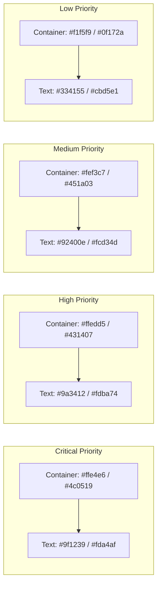

# 🎨 Каталог уніфікованих кольорових палітр (M3 Expressive Palettes Catalog)

> **Стандарт:** Google Material 3 Expressive Design System  
> **Принцип побудови:** HCT (Hue, Chroma, Tone) колірний простір, де відтінки контейнерів і тексту підпорядковуються закону контрастності $\Delta\text{Tone} \ge 60$ для забезпечення читабельності WCAG 2.1 AAA.

---

## 1. Базова системна палітра (Core System Palette)

### 🔵 Primary (Google Pixel Blue)
| Роль | Токен | Light Mode (Hex) | Dark Mode (Hex) | Tone (L/D) | Призначення |
|---|---|---|---|---|---|
| **Primary** | `--md-sys-color-primary` | `#0b57d0` | `#a8c7fa` | 40 / 80 | Головні CTA кнопки, активні стани, фокус |
| **On-Primary** | `--md-sys-color-on-primary` | `#ffffff` | `#041e49` | 100 / 10 | Текст/іконки поверх Primary |
| **Primary Container** | `--md-sys-color-primary-container` | `#d3e3fd` | `#041e49` | 90 / 20 | Чіпси, активні пункти бокової панелі, статус "In Progress" |
| **On-Primary Container** | `--md-sys-color-on-primary-container` | `#041e49` | `#d3e3fd` | 10 / 90 | Текст всередині Primary Container |

---

### 🟣 Secondary & Tertiary (Slate & Iris Purple)
| Роль | Токен | Light Mode (Hex) | Dark Mode (Hex) | Tone (L/D) | Призначення |
|---|---|---|---|---|---|
| **Secondary** | `--md-sys-color-secondary` | `#535f70` | `#bcc7db` | 40 / 80 | Допоміжні контролери, згорнуті стани |
| **Secondary Container** | `--md-sys-color-secondary-container` | `#d7e3f8` | `#101c2b` | 90 / 20 | Tonal кнопки, фільтри |
| **Tertiary** | `--md-sys-color-tertiary` | `#6e5676` | `#dabde2` | 40 / 80 | Спеціальні мітки, бейджі |
| **Tertiary Container** | `--md-sys-color-tertiary-container` | `#f7d8ff` | `#271330` | 90 / 20 | Статус "Review / QA", спринт-аналітика |

---

## 2. Семантичні статуси та пріоритети (Semantic Statuses)

### 🟢 Success, Warning, Error
| Роль | Контейнер (Light/Dark) | Текст/Іконка (Light/Dark) | Призначення |
|---|---|---|---|
| **Success** | `#c4eed0` / `#072711` | `#072711` / `#6dd58c` | Статуси "Resolved", "Done", збереження |
| **Warning** | `#fef3c7` / `#78350f` | `#78350f` / `#ffba38` | Попередження, незавершені дії |
| **Error** | `#ffdad6` / `#410002` | `#410002` / `#ffb4ab` | Помилки, статус "Blocked", видалення |

---

### 🏷️ Матриця пріоритетів тікетів (Priority Tonal Tokens)

---

## 3. П'ятирівнева ієрархія поверхонь (Surface Tiers)

| Рівень | Токен | Light Mode | Dark Mode | Застосування |
|---|---|---|---|---|
| **Level 0 (Background)** | `--md-sys-color-surface-container-lowest` | `#ffffff` | `#0c0e12` | Внутрішній фон селектів, попапів, канбан колонок |
| **Level 1 (Low)** | `--md-sys-color-surface-container-low` | `#f2f3fa` | `#17191e` | Зовнішній каркас Super-Sidebar, фон модалок |
| **Level 2 (Default)** | `--md-sys-color-surface-container` | `#eceef6` | `#1b1d24` | Картки тікетів, панелі фільтрів |
| **Level 3 (High)** | `--md-sys-color-surface-container-high` | `#e6e8f0` | `#262830` | Hover стани кнопок, активні рядки таблиць |
| **Level 4 (Highest)** | `--md-sys-color-surface-container-highest` | `#e0e3ea` | `#31333c` | Тултіпи, активні чіпси, драг-прев'ю |

---

## 4. Правила для розробників та агентів
1. **Заборона хардкоду кольорів:** Використання класів на кшталт `bg-blue-500`, `text-red-600` або `bg-[#123456]` категорично заборонено у продуктових компонентах.
2. **Контейнерне правило:** Якщо елемент має фон `*-container`, його текст обов'язково повинен мати колір `on-*-container`.
3. **Радіуси заокруглень:**
   - Картки та модалки: `rounded-2xl` (16px) або `rounded-3xl` (24px).
   - Кнопки, інпути, селекти: `rounded-xl` (12px).
   - Чіпси та бейджі: `rounded-lg` (8px) або `rounded-full` (9999px).
