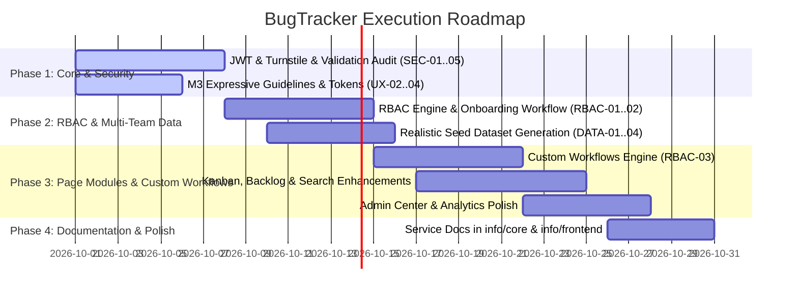
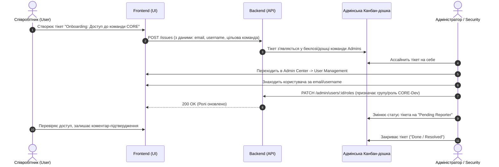

# 📋 Звіт з аналізу та декомпозиції планів (Notes Report)

> **Джерело:** [`info/notes.txt`](file:///home/finkord/dev/PPofSE/software/info/notes.txt)  
> **Мета:** Систематизація, категорізація за тематичними блоками та створення детального беклогу завдань (Action Plan) для розвитку системи **BugTracker**.

---

## 🧭 Зміст звіту
1. [Тематичний огляд та класифікація](#1-тематичний-огляд-та-класифікація)
2. [Детальна декомпозиція по напрямкам (Tasks & Epics)](#2-детальна-декомпозиція-по-напрямкам-tasks--epics)
   - [Епік 1: UI/UX дизайн-система, прототипування та правила](#епік-1-uiux-дизайн-система-прототипування-та-правила)
   - [Епік 2: Генерація реалістичних тестових даних (Seed Data & Dogfooding)](#епік-2-генерація-реалістичних-тестових-даних-seed-data--dogfooding)
   - [Епік 3: Адміністрування, RBAC, онбординг та Custom Workflows](#епік-3-адміністрування-rbac-онбординг-та-custom-workflows)
   - [Епік 4: Функціональні модулі та сторінки додатку](#епік-4-функціональні-модулі-та-сторінки-додатку)
   - [Епік 5: Безпека, автентифікація та ядро (Core Security)](#епік-5-безпека-автентифікація-та-ядро-core-security)
   - [Епік 6: Стандарти розробки, документація та планування](#епік-6-стандарти-розробки-документація-та-планування)
3. [Матриця пріоритетів та черговість виконання (Roadmap)](#3-матриця-пріоритетів-та-черговість-виконання-roadmap)
4. [Діаграма онбордингу та взаємодії сервісів](#4-діаграма-онбордингу-та-взаємодії-сервісів)

---

## 1. Тематичний огляд та класифікація

Аналіз вхідного файлу нотаток виділив **6 ключових напрямків (Епіків)**:

```mermaid
mindmap
  root((BugTracker Plans))
    UI/UX & Design System
      Wireframes & Prototyping
      Material 3 Expressive
      Standard Component Library
      Color Harmony & Tokens
    Seed Data & Dogfooding
      Multi-Team Structure (UI, CORE, MONOPS...)
      Realistic Tickets & Links
      5-10 Devs per Team
      Time Tracking Matrix
    RBAC & Team Management
      Jira-like Space Administration
      Access Requests via Tickets
      Custom Workflows Engine
      Security/Admin Roles
    Page Modules
      Landing & Auth Pages
      Kanban & Backlog/Sprints
      Dashboard & User Profile
      Admin Center & Analytics
      Search (JQL) & Time Matrix
    Core Security & Auth
      JWT Strategy & Refresh Rotation
      Cloudflare Turnstile Captcha
      Argon2/Bcrypt Password Hashing
      Backend DTO Validation
      SDSecurity Lab6 Compliance
    Engineering Standards
      Pre-planning in info/planning
      Mermaid Architecture Docs
      Service Docs in info/core
```

---

## 2. Детальна декомпозиція по напрямкам (Tasks & Epics)

### Епік 1: UI/UX дизайн-система, прототипування та правила
> **Фокус:** Створення єдиної візуальної мови, унеможливлення верстки «з нуля» на окремих сторінках, гармонізація палітри.

| ID | Завдання | Опис та деталі | Статус / Пріоритет |
|---|---|---|---|
| **UX-01** | **Дослідження інструментів прототипування** | Аналіз можливостей створення wireframes/mockups за допомогою генерації UI-артефактів, інтеграції з Figma-плагінами чи SVG/HTML-каркасів. | `High` |
| **UX-02** | **Єдина дизайн-система (M3 Expressive)** | Впровадження правил UX-дизайну: токени `--md-sys-color-*`, HCT-гармонія кольорів, контрастність $\Delta\text{Tone} \ge 60$. Збережено у [m3_expressive_design_system_rules.md](file:///home/finkord/dev/PPofSE/software/info/instructions/design/m3_expressive_design_system_rules.md). | `Done / High` |
| **UX-03** | **Уніфікований каталог палітр** | Фіксація палітр тем у коді та створення довідника [color_palettes_catalog.md](file:///home/finkord/dev/PPofSE/software/info/design/color_palettes_catalog.md). | `Done / High` |
| **UX-04** | **Базова бібліотека спільних компонентів** | Реалізовано повний набір спільних компонентів (`Button`, `Input`, `SelectField`/`Select`, `Badge`, `Card`, `Modal`, `DropdownMenu`, `Tabs`, `Tooltip`) з Radix UI доступністю в [src/components/ui/](file:///home/finkord/dev/PPofSE/software/frontend/src/components/ui/index.ts). | `Done / High` |

---

### Епік 2: Генерація реалістичних тестових даних (Seed Data & Dogfooding)
> **Фокус:** Створення цілісного демо-середовища, де команди розробників «догфудять» сам BugTracker.

| ID | Завдання | Опис та деталі | Статус / Пріоритет |
|---|---|---|---|
| **DATA-01** | **Створення структури команд** | Генерація команд: `UI`, `CORE`, `MONOPS`, `INFRAOPS`, `NETOPS` тощо. Кожна команда має власний ключ, аватар, опис. | `Medium` |
| **DATA-02** | **Пул користувачів (5–10 осіб на команду)** | Генерація реалістичних облікових записів розробників, тімлідів, DevOps, Security з аватарами та ролями. | `Medium` |
| **DATA-03** | **Канбан-тікети та перехресні зв'язки** | Наповнення дошок тікетами з перехресними залежностями (`blocks`, `relates to`, `depends on`) для демонстрації взаємодії команд. | `Medium` |
| **DATA-04** | **Матриця логування часу** | Генерація історії витраченого часу (Time Logs) для демонстрації звітів та щотижневої матриці. | `Medium` |

---

### Епік 3: Адміністрування, RBAC, онбординг та Custom Workflows
> **Фокус:** Гнучке розмежування прав, автоматизація видачі доступів та кастомізація життєвого циклу тікетів.

| ID | Завдання | Опис та деталі | Статус / Пріоритет |
|---|---|---|---|
| **RBAC-01** | **Дослідження моделі адміністрування Jira** | Аналіз та проектування ролей (Admins, Security, DevOps, Team Leads, Developers, Viewers) та просторів команд. | `High` |
| **RBAC-02** | **Онбординг-воркфлоу через тікети** | Створення процесу: запит на доступ у тікеті $\rightarrow$ ассайн на адміна $\rightarrow$ зміна ролей в User Management $\rightarrow$ переведення тікета в `Pending Reporter` $\rightarrow$ підтвердження. | `High` |
| **RBAC-03** | **Кастомні Workflow для команд** | Можливість налаштування індивідуальних життєвих циклів тікетів для кожної команди (додавання специфічних статусів: `Pending Approval`, `Pending Reporter`, `Code Review` тощо). | `Medium` |

---

### Епік 4: Функціональні модулі та сторінки додатку
> **Фокус:** Покриття всіх вимог до UI-сторінок та бізнес-логіки.

| № | Сторінка / Модуль | Ключовий функціонал | Пріоритет |
|---|---|---|---|
| **1** | **Landing Page** | Публічна сторінка для гостей: короткий опис системи, фічі, заклик до реєстрації/входу. | `Medium` |
| **2** | **Auth Pages** | Реєстрація та логін (OAuth Google/GitHub, Turnstile капча, 2FA prompt). | `High` |
| **3** | **Dashboard** | Персональний хаб: швидкий перехід до канбану команди, призначені тікети, збережені фільтри, активність. | `High` |
| **4** | **Teams / Projects** | Каталог команд з аватарами, швидким пошуком та контекстним перемикачем. | `High` |
| **5** | **Kanban Board** | Дошка команди: групування за співробітниками (Assignee Swimlanes), drag-and-drop, quick filters. | `High` |
| **6** | **Backlog & Agile** | Управління спринтами, оцінка Story Points, планування релізів. | `High` |
| **7** | **User Profile** | Відомості про роль/команду, сесії пристроїв, аудит активності, редагування профілю, підключення OAuth, 2FA. | `Medium` |
| **8** | **Preferences** | Налаштування теми (Dark/Light), вигляду бокової панелі, щільності інтерфейсу. | `Medium` |
| **9** | **Admin Center** | Керування банерами сповіщень, User Management, системні логи, аналітика безпеки/2FA. | `High` |
| **10** | **Advanced Search** | JQL-пошук, вибірки для тріажу нових тікетів, збережені фільтри. | `High` |
| **11** | **Time Tracking** | Сторінка та щотижнева матриця списання годин за проектами/користувачами. | `Medium` |
| **12** | **Analytics & Reports** | Менеджерські звіти: Velocity, Burndown, розподіл навантаження. | `Low` |

---

### Епік 5: Безпека, автентифікація та ядро (Core Security)
> **Фокус:** Надійність аутентифікації, захист від атак та відповідність вимогам лабораторної роботи.

| ID | Завдання | Критерії перевірки та стандарти | Статус / Пріоритет |
|---|---|---|---|
| **SEC-01** | **Аудит JWT-стратегії** | Дотримання безпеки: Access/Refresh токени, захищені `HttpOnly` cookie або безпечний заголовок, ротація токенів, revocation list. | `Critical` |
| **SEC-02** | **Cloudflare Turnstile** | Перевірка валідності токена капчі на бекенді через Cloudflare Siteverify API; захист ендпоінтів реєстрації та скидання паролю. | `Critical` |
| **SEC-03** | **Хешування паролів** | Використання стійких алгоритмів (`Argon2id` або `bcrypt` з достатнім cost factor) та унікальної солі. | `Critical` |
| **SEC-04** | **Валідація DTO на бекенді** | Строга типізація через NestJS `class-validator`, `ValidationPipe({ whitelist: true, forbidNonWhitelisted: true })`, санітизація полів. | `Critical` |
| **SEC-05** | **Відповідність SDSecurity Lab 6** | Звірка реалізації з конкретними пунктами вимог безпеки лабораторної роботи №6. | `High` |

---

### Епік 6: Стандарти розробки, документація та планування
> **Фокус:** Дотримання дисципліни розробки, трасування архітектурних рішень.

| ID | Вимога | Правило реалізації |
|---|---|---|
| **DOC-01** | **Обов'язкове попереднє планування** | Перед початком розробки будь-якого великого модуля створюється файл плану в каталозі `info/planning/*.md`. |
| **DOC-02** | **Архітектурна документація модулів** | Завершені модулі документуються в `info/core/<service>/*.md` або `info/frontend/*.md` з описом архітектури, залежностей та діаграмами Mermaid / PNG. |
| **DOC-03** | **Формат діаграм** | Допускається збереження діаграм у форматі Mermaid безпосередньо в MD-файлах, а також експорт в PNG. |

---

## 3. Матриця пріоритетів та черговість виконання (Roadmap)



---

## 4. Діаграма онбордингу та взаємодії сервісів

Наочна схема процесу видачі прав через тікет-систему згідно з описом у нотатках:



---

> [!TIP]
> Цей документ слугує центральним орієнтиром для формування задач у спринтах та створення планів у каталозі `info/planning/`.
