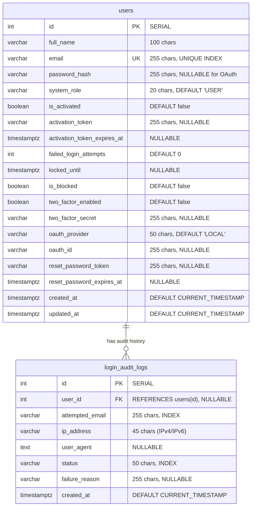
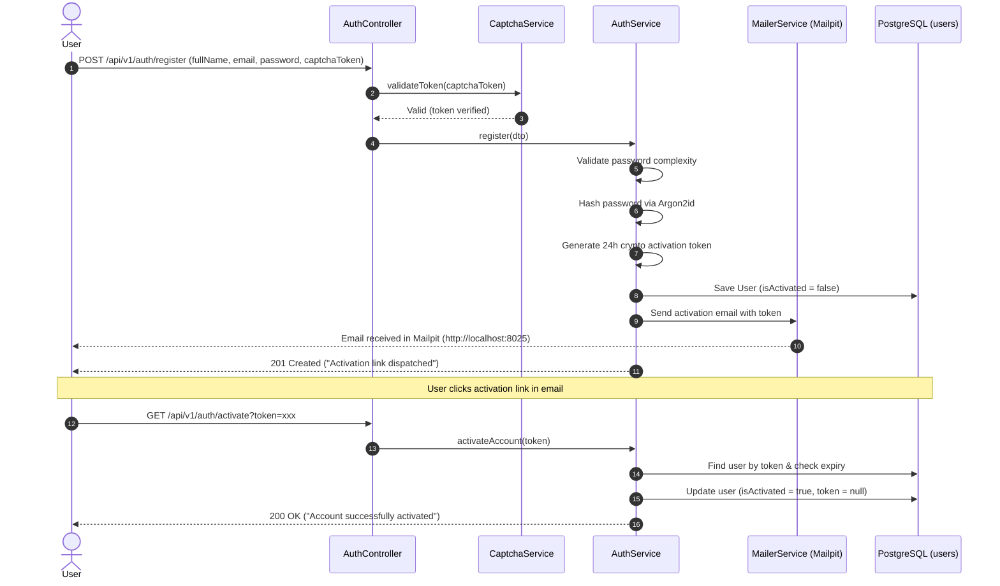
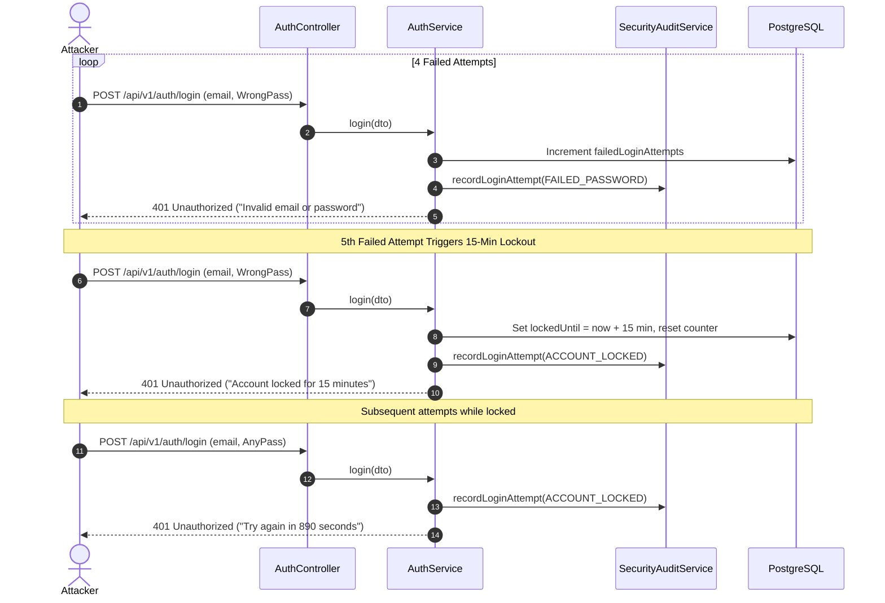
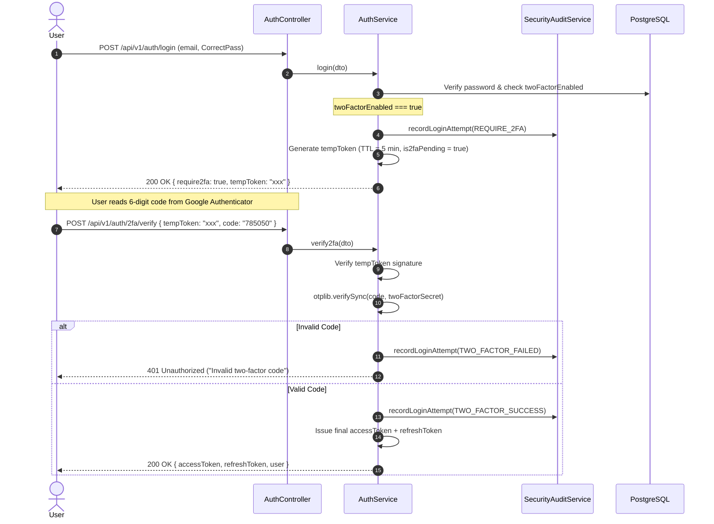

# Authentication & Security Service (`AuthModule`) Documentation

This document provides a comprehensive technical reference for the **Authentication & Security Service** implemented within the Bug / Issue Tracking System (`software/backend`). 

This service serves as the security foundation for the entire software engineering project (**PPofSE** Labs 1–7) and directly fulfills all 7 required tasks of the **SDSecurity (Software and Data Security) Lab 6 Project** (15 points).

---

## 1. Architectural Overview

The authentication service is designed as a **Modular Monolith** component within NestJS 12 (Node.js v24 LTS runtime), strictly following Domain-Driven Design (DDD) layering:

```
[ HTTP Requests ]
        │
        ▼
[ Global Pipes & Guards ] (ValidationPipe, ThrottlerGuard, JwtAuthGuard, RolesGuard)
        │
        ▼
[ Controllers ] (AuthController, UsersController, SecurityAuditController)
        │
        ▼
[ Domain Services ] (AuthService, UsersService, SecurityAuditService, CaptchaService)
        │
        ▼
[ Data Access / TypeORM ] (User Entity, LoginAuditLog Entity)
        │
        ▼
[ Infrastructure ] (PostgreSQL 15, Redis 7, Mailpit SMTP, GitHub OAuth2)
```

### Key Architectural Characteristics
* **Zero-Trust Input Validation:** Every incoming request body is strictly parsed and sanitized by `ValidationPipe({ whitelist: true, transform: true })` using declarative `class-validator` DTOs.
* **Modern Password Security:** Enforces Argon2id (the winner of the Password Hashing Competition) over legacy bcrypt, protecting against GPU/ASIC brute-force attacks.
* **Time-Based One-Time Passwords (TOTP):** Full RFC 6238 implementation allowing users to pair Google Authenticator, Microsoft Authenticator, or Authy via QR codes.
* **Forensic Audit Logging:** Every single authentication attempt (success, bad password, account lock, 2FA challenge, 2FA failure, OAuth login) is recorded with client IP, User-Agent, and timestamps.
* **Stateless JWT with Defense-in-Depth:** Short-lived access tokens (15 minutes) paired with longer refresh tokens (7 days). Sensitive user attributes (`passwordHash`, `twoFactorSecret`, tokens) are stripped automatically during JSON serialization via custom `toJSON()` implementation.

---

## 2. Directory & Module Structure

The authentication and security domain spans four coordinated NestJS modules under `src/modules/` and shared cross-cutting infrastructure under `src/common/`:

```
backend/src/
├── app.module.ts                         # Root application module registering all dependencies
├── main.ts                               # Bootstrap script (Swagger, CORS, validation, prefix /api/v1)
├── common/                               # Cross-cutting security guards and decorators
│   ├── decorators/
│   │   ├── current-user.decorator.ts     # Injects authenticated User entity into controller handlers
│   │   └── roles.decorator.ts            # Sets metadata for Role-Based Access Control (@Roles('ADMIN'))
│   └── guards/
│       ├── jwt-auth.guard.ts             # Enforces valid Bearer JWT on protected endpoints
│       └── roles.guard.ts                # Validates user systemRole against @Roles() decorator
└── modules/
    ├── auth/                             # Core Authentication Domain
    │   ├── auth.controller.ts            # REST routes for auth, 2FA, password reset, OAuth
    │   ├── auth.module.ts                # Auth module definition and provider wiring
    │   ├── auth.service.ts               # Core authentication business logic & crypto operations
    │   ├── dto/                          # Data Transfer Objects with validation rules
    │   │   ├── login.dto.ts              # Login credentials payload
    │   │   ├── oauth-mock.dto.ts         # Simulated OAuth payload for demo & automated testing
    │   │   ├── password-reset.dto.ts     # Forgot password & Reset password payloads
    │   │   ├── register.dto.ts           # Registration payload with password regex & CAPTCHA
    │   │   ├── set-password.dto.ts       # Set/update password payload (for OAuth or existing users)
    │   │   └── verify-2fa.dto.ts         # TOTP verification and enablement payloads
    │   └── strategies/
    │       ├── github.strategy.ts        # Passport GitHub OAuth2 strategy (passport-github2)
    │       ├── google.strategy.ts        # Passport Google OAuth2 strategy (passport-google-oauth20)
    │       └── jwt.strategy.ts           # Passport JWT Bearer token validation strategy
    ├── users/                            # User Account Management Domain
    │   ├── entities/
    │   │   └── user.entity.ts            # TypeORM Entity for 'users' table
    │   ├── users.controller.ts           # Profile (GET /users/me), Admin user management & blocking
    │   ├── users.module.ts               # Users module definition
    │   └── users.service.ts              # User persistence, lookup, updates, and role assignments
    ├── security-audit/                   # Security Forensics & Audit Trail Domain
    │   ├── entities/
    │   │   └── login-audit-log.entity.ts # TypeORM Entity for 'login_audit_logs' table
    │   ├── security-audit.controller.ts  # Admin endpoint for forensic audit log inspection
    │   ├── security-audit.module.ts      # Security audit module definition
    │   └── security-audit.service.ts     # Audit log writer and paginated querying
    └── captcha/                          # Bot Prevention Domain
        ├── captcha.module.ts             # Captcha module definition
        └── captcha.service.ts            # Cloudflare Turnstile / reCAPTCHA API verification
```

---

## 3. Dependencies & Technology Stack

Below is the complete inventory of libraries utilized by the authentication service, detailing their technical purpose and justification:

| Package | Version | Layer / Purpose | Rationale & Selection Justification |
| :--- | :--- | :--- | :--- |
| `argon2` | `^0.45.1` | Password Hashing (Task 1) | Implements **Argon2id** (memory-hard, resistant to side-channel and GPU/ASIC cracking attacks). Recommended by OWASP over standard bcrypt. |
| `bcrypt` | `^6.0.0` | Secondary Crypto Support | Installed as a fallback and compatible utility for legacy hash verification if required. |
| `@nestjs/passport` | `^12.0.0` | Auth Orchestration | Official NestJS bridge for the standard Node.js authentication middleware ecosystem (`Passport.js`). |
| `passport` | `^0.7.0` | Strategy Framework | Core authentication middleware providing modular strategy registration (`jwt`, `github`). |
| `passport-jwt` | `^4.0.1` | Token Verification | Strategy for extracting and verifying Bearer JSON Web Tokens from HTTP `Authorization` headers. |
| `@nestjs/jwt` | `^12.0.2` | JWT Lifecycle Management | Manages token signing, claims encoding (`sub`, `email`, `role`), and cryptographic expiration. |
| `passport-github2` | `^0.2.0` | Federated OAuth2 (Task 6) | Implements GitHub OAuth2 web application flow for external identity delegation. |
| `passport-google-oauth20` | `^2.0.0` | Federated OAuth2 (Task 6) | Implements Google OAuth2 / OpenID Connect web application flow for external identity delegation. |
| `otplib` | `^13.5.0` | 2FA / TOTP (Task 5) | Modern RFC 6238 Time-based One-Time Password generator and validator. Uses native crypto and typed APIs. |
| `qrcode` | `^1.5.4` | QR Code Generation (Task 5)| Generates Data URL QR codes from `otpauth://` URIs for scanning with Google Authenticator or Authy. |
| `@nestjs-modules/mailer` | `^2.3.7` | Email Dispatch (Tasks 3, 7)| High-level mailer abstraction for sending HTML transactional emails via SMTP. |
| `nodemailer` | `^10.0.10` | SMTP Protocol Client | Under-the-hood transport used by the mailer module to deliver emails to local Mailpit or production SMTP. |
| `class-validator` | `^0.15.1` | Request Validation | Declarative DTO validation rules (`@MinLength`, `@Matches`, `@IsEmail`, `@IsEnum`, `@IsNotEmpty`). |
| `class-transformer` | `^0.5.1` | Object Transformation | Transforms raw HTTP request payloads into typed class instances for validation pipes. |
| `@nestjs/throttler` | `^6.7.0` | Rate Limiting (Task 4) | In-memory / Redis rate limiting mitigating automated credential stuffing and DoS attacks. |
| `@nestjs/swagger` | `^12.0.1` | API Documentation | Generates interactive OpenAPI 3.0 specifications and Swagger UI at `/api/docs`. |
| `@nestjs/typeorm` & `typeorm` | `^12.0.1` / `^1.1.1` | ORM & Database Layer | Object-Relational Mapping providing repository patterns, migrations, and PostgreSQL driver bindings. |
| `pg` | `^8.23.0` | PostgreSQL Driver | High-performance PostgreSQL client connection pool. |

---

## 4. Database Schema & Tables

The authentication service relies on two core tables in PostgreSQL 15: `users` and `login_audit_logs`.



### Table 1: `users`

Stores credentials, role assignments, activation status, lockout counters, and security preferences.

| Column | Type | Constraints | Description |
| :--- | :--- | :--- | :--- |
| `id` | `SERIAL` | `PRIMARY KEY` | Unique identifier for each user account. |
| `full_name` | `VARCHAR(100)` | `NOT NULL` | User's full display name. |
| `email` | `VARCHAR(255)` | `NOT NULL, UNIQUE` | Unique email address used for login and notifications. Indexed. |
| `password_hash` | `VARCHAR(255)` | `NULLABLE` | Argon2id hash of the password. Null for pure OAuth accounts. |
| `system_role` | `VARCHAR(20)` | `NOT NULL, DEFAULT 'USER'` | Authorization role: `'ADMIN'` or `'USER'`. First user auto-assigned `'ADMIN'`. |
| `is_activated` | `BOOLEAN` | `NOT NULL, DEFAULT false` | **SDSecurity Task 3:** True if email address verified. |
| `activation_token` | `VARCHAR(255)` | `NULLABLE` | Cryptographic random hex token (TTL = 24h) for email activation. |
| `activation_token_expires_at` | `TIMESTAMPTZ` | `NULLABLE` | Expiration timestamp for account activation token. |
| `failed_login_attempts` | `INT` | `NOT NULL, DEFAULT 0` | **SDSecurity Task 4:** Count of consecutive failed password attempts. |
| `locked_until` | `TIMESTAMPTZ` | `NULLABLE` | **SDSecurity Task 4:** Timestamp until which account is temporarily locked (15 mins). |
| `is_blocked` | `BOOLEAN` | `NOT NULL, DEFAULT false` | **SDSecurity Task 4:** Administrative block flag for manual suspension. |
| `two_factor_enabled` | `BOOLEAN` | `NOT NULL, DEFAULT false` | **SDSecurity Task 5:** True if 2FA TOTP is active on the account. |
| `two_factor_secret` | `VARCHAR(255)` | `NULLABLE` | **SDSecurity Task 5:** Base32 encoded shared secret for RFC 6238 TOTP. |
| `oauth_provider` | `VARCHAR(50)` | `NOT NULL, DEFAULT 'LOCAL'` | **SDSecurity Task 6:** Identity source (`'LOCAL'`, `'GITHUB'`, `'GOOGLE'`). |
| `oauth_id` | `VARCHAR(255)` | `NULLABLE` | **SDSecurity Task 6:** Provider's unique user identifier. |
| `reset_password_token` | `VARCHAR(255)` | `NULLABLE` | **SDSecurity Task 7:** Cryptographic random hex token (TTL = 15m) for reset flow. |
| `reset_password_expires_at` | `TIMESTAMPTZ` | `NULLABLE` | Expiration timestamp for password reset token. |
| `created_at` | `TIMESTAMPTZ` | `NOT NULL, DEFAULT NOW()` | Account creation timestamp. |
| `updated_at` | `TIMESTAMPTZ` | `NOT NULL, DEFAULT NOW()` | Account last update timestamp. |

---

### Table 2: `login_audit_logs`

Provides a tamper-evident forensic log of all login attempts (SDSecurity Task 4).

| Column | Type | Constraints | Description |
| :--- | :--- | :--- | :--- |
| `id` | `SERIAL` | `PRIMARY KEY` | Log entry ID. |
| `user_id` | `INT` | `NULLABLE, FK -> users(id)` | Foreign key to user account if identified (nullable for non-existent users). |
| `attempted_email` | `VARCHAR(255)` | `NOT NULL, INDEX` | Email address submitted during the login attempt. |
| `ip_address` | `VARCHAR(45)` | `NOT NULL` | Client IP address (supports IPv4 and IPv6). |
| `user_agent` | `TEXT` | `NULLABLE` | Browser / client User-Agent string. |
| `status` | `VARCHAR(50)` | `NOT NULL, INDEX` | Log status enum (see values below). |
| `failure_reason` | `VARCHAR(255)` | `NULLABLE` | Detailed reason for failure (e.g. `"Failed password attempt 4/5"`). |
| `created_at` | `TIMESTAMPTZ` | `NOT NULL, DEFAULT NOW()` | Precise timestamp of the attempt. |

#### Status Enum (`LoginAttemptStatus`)
* `SUCCESS`: Password verified and tokens issued (or OAuth completed).
* `FAILED_PASSWORD`: Incorrect password submitted.
* `ACCOUNT_LOCKED`: Login attempt rejected due to active 15-minute brute-force lockout.
* `ACCOUNT_BLOCKED`: Login attempt rejected because account was suspended by administrator.
* `USER_NOT_FOUND`: Submitted email does not match any registered user.
* `REQUIRE_2FA`: Password verified; system issued temporary challenge token waiting for TOTP code.
* `TWO_FACTOR_FAILED`: Submitted 6-digit TOTP passcode was incorrect.
* `TWO_FACTOR_SUCCESS`: 6-digit TOTP passcode verified; session tokens issued.

---

## 5. Security Tasks Implementation (SDSecurity Lab 6)

### Task 1: Registration with Complex Password Policy
* **Password Policy:** Enforced via regex in `RegisterDto`:
  * Minimum 8 characters.
  * At least 1 uppercase letter (`(?=.*[A-Z])`).
  * At least 1 lowercase letter (`(?=.*[a-z])`).
  * At least 1 numeric digit (`(?=.*\d)`).
  * At least 1 special symbol (`(?=.*[@$!%*?&^#()_+={}\[\]:;"'<>,.\/\\|~-])`).
* **Argon2id Hashing:** Password hashed with `argon2.hash(password, { type: argon2.argon2id, memoryCost: 65536, timeCost: 3, parallelism: 1 })`.
* **RBAC Initialization:** The first registered account automatically receives the `ADMIN` role; subsequent accounts are assigned `USER`.
* **Profile Endpoint:** Protected via `JwtAuthGuard` at `GET /api/v1/users/me`.

### Task 2: Bot Prevention (CAPTCHA)
* **Validation:** Mandatory `captchaToken` in `RegisterDto`.
* **Verification Pipeline:** `CaptchaService.validateToken(token, ip)` sends a POST request to the verification endpoint (`https://challenges.cloudflare.com/turnstile/v0/siteverify` for Cloudflare Turnstile or Google reCAPTCHA).
* **Development Testing:** Recognizes explicit bypass tokens (`valid-captcha-token`, `test-token`) during local development and testing.

### Task 3: Email Account Activation
* **Token Generation:** 32-byte cryptographically secure token via `crypto.randomBytes(32).toString('hex')`.
* **TTL:** 24 hours (`activationTokenExpiresAt = new Date(Date.now() + 24 * 3600 * 1000)`).
* **Delivery:** Dispatched via `MailerService` through Mailpit SMTP (port `1025`). Contains HTML email with clickable activation link: `http://localhost:3000/api/v1/auth/activate?token=...`.
* **Single-Use Enforcement:** Upon successful activation, `isActivated` is set to `true`, and `activationToken` and `activationTokenExpiresAt` are permanently cleared (`null`). Subsequent calls return `400 Bad Request`.

### Task 4: Brute-Force Protection & Audit Logging
* **Lockout Rule:** On password mismatch, `failedLoginAttempts` increments by 1. When reaching 5 failed attempts:
  * `lockedUntil` is set to `now + 15 minutes` (900 seconds).
  * `failedLoginAttempts` resets to 0.
* **Lockout Enforcement:** Any login attempt while `lockedUntil > now` is immediately rejected with HTTP `401 Unauthorized` indicating remaining lockout seconds.
* **Successful Reset:** On valid login, `failedLoginAttempts` and `lockedUntil` are immediately cleared.
* **Audit Trail:** Every login event writes a row to `login_audit_logs`.
* **Admin Controls:**
  * `GET /api/v1/admin/security/login-logs`: Paginated view of audit logs.
  * `PATCH /api/v1/users/:id/block`: Manually block malicious accounts.
  * `PATCH /api/v1/users/:id/unblock`: Restore blocked accounts and clear lockouts.

### Task 5: Two-Factor Authentication (2FA / TOTP)
* **Standard:** RFC 6238 Time-based One-time Password algorithm (SHA-1, 6 digits, 30-second window).
* **Setup Flow:**
  1. `POST /api/v1/auth/2fa/generate`: Generates Base32 secret via `otplib.generateSecret()`.
  2. Generates standard `otpauth://totp/...` URI via `otplib.generateURI(...)`.
  3. Uses `qrcode.toDataURL(...)` to generate a Base64 PNG image directly renderable by frontends or scanners.
  4. User enters 6-digit confirmation code into `POST /api/v1/auth/2fa/enable`. Secret is activated and `twoFactorEnabled` set to `true`.
* **Challenge Flow during Login:**
  1. User enters email and password into `POST /api/v1/auth/login`.
  2. If `user.twoFactorEnabled === true`, the server does NOT issue access tokens. Instead, it issues a short-lived **challenge token** (5 min TTL) with claim `{ is2faPending: true }`.
  3. User submits challenge token and 6-digit TOTP code to `POST /api/v1/auth/2fa/verify`.
  4. Server validates passcode via `otplib.verifySync(...)` and issues final access and refresh tokens.

### Task 6: External Identity Providers (OAuth2: GitHub & Google) & Credential Linking
* **GitHub Integration:** Built using `passport-github2` strategy.
  * `GET /api/v1/auth/github`: Initiates GitHub OAuth2 flow by redirecting browser to `https://github.com/login/oauth/authorize`.
  * `GET /api/v1/auth/github/callback`: Receives authorization code, exchanges it for profile claims, provisions or links user (`oauthProvider = GITHUB`), and redirects browser to `${FRONTEND_URL}/oauth/callback?accessToken=...&refreshToken=...`.
* **Google Integration:** Built using `passport-google-oauth20` strategy.
  * `GET /api/v1/auth/google`: Initiates Google OAuth2 consent by redirecting to `https://accounts.google.com/o/oauth2/v2/auth` (`scope: ['email', 'profile']`).
  * `GET /api/v1/auth/google/callback`: Receives authorization code from Google, provisions/links user account (`oauthProvider = GOOGLE`), and redirects to frontend with session tokens.
* **Account Password Management (`POST /api/v1/auth/set-password`):**
  * Enables OAuth accounts (`passwordHash: null`) to establish an Argon2id password without entering a current password.
  * Enables users with existing passwords to change passwords securely by verifying `currentPassword`.
  * Allows dual-authentication: accounts can be accessed via either OAuth or standard email & password.
* **Testing & Offline Support:** `POST /api/v1/auth/oauth/mock` accepts provider claims (`provider`, `oauthId`, `email`, `fullName`) and exercises the exact same identity linking and provisioning logic.

### Task 7: Password Reset Flow
* **Initiation:** `POST /api/v1/auth/forgot-password` with email.
* **Token:** 32-byte cryptographic token with 15-minute TTL (`resetPasswordExpiresAt`).
* **Delivery:** Dispatched via Mailpit email with link and raw token.
* **Execution:** `POST /api/v1/auth/reset-password` accepts token and `newPassword`.
* **Security Checks:**
  1. Validates token existence and checks `resetPasswordExpiresAt > now`.
  2. Validates that `newPassword` satisfies the strict password policy.
  3. Updates `passwordHash` with new Argon2id hash.
  4. Clears reset token and **automatically clears any active brute-force lockout (`lockedUntil = null`)**.

---

## 6. Authentication Flows (Sequence Diagrams)

### Flow 1: Registration and Email Account Activation (Tasks 1, 2, 3)



---

### Flow 2: Login with Brute-Force Lockout (Task 4)



---

### Flow 3: Two-Factor Authentication (TOTP) Challenge Flow (Task 5)



---

## 7. REST API Endpoints Reference

All endpoints are registered under the global prefix `/api/v1` and documented in Swagger UI at `http://localhost:3000/api/docs`.

| Method | Endpoint | Access | Task | Description |
| :--- | :--- | :--- | :--- | :--- |
| `POST` | `/auth/register` | Public | 1, 2, 3 | Register new user account with complex password & CAPTCHA. |
| `GET` | `/auth/activate` | Public | 3 | Activate account using email token link. |
| `POST` | `/auth/login` | Public | 1, 4, 5 | Authenticate user credentials; enforces lockout and 2FA challenge. |
| `POST` | `/auth/2fa/generate` | Bearer JWT | 5 | Generate Base32 TOTP secret and QR code Data URL. |
| `POST` | `/auth/2fa/enable` | Bearer JWT | 5 | Confirm 6-digit TOTP code and enable 2FA on account. |
| `POST` | `/auth/2fa/disable` | Bearer JWT | 5 | Confirm code and disable 2FA on account. |
| `POST` | `/auth/2fa/verify` | Public | 5 | Submit 6-digit TOTP code with challenge token to complete login. |
| `POST` | `/auth/forgot-password` | Public | 7 | Request single-use 15-minute password reset link via email. |
| `POST` | `/auth/reset-password` | Public | 7 | Set new password using reset token; clears brute-force lockout. |
| `POST` | `/auth/set-password` | Bearer JWT | 1, 6 | Establish password on OAuth account or change existing password (Argon2id). |
| `GET` | `/auth/github` | Public | 6 | Redirect browser to GitHub OAuth2 login. |
| `GET` | `/auth/github/callback` | Public | 6 | Process GitHub OAuth2 authorization code and redirect to frontend with tokens. |
| `GET` | `/auth/google` | Public | 6 | Redirect browser to Google OAuth2 consent screen. |
| `GET` | `/auth/google/callback` | Public | 6 | Process Google OAuth2 authorization code and redirect to frontend with tokens. |
| `POST` | `/auth/oauth/mock` | Public | 6 | Simulated OAuth2 login for demo and automated test pipelines. |
| `GET` | `/users/me` | Bearer JWT | 1 | Retrieve profile of the currently authenticated user. |
| `GET` | `/users` | Admin JWT | 4 | List all registered users (paginated). |
| `PATCH` | `/users/:id/block` | Admin JWT | 4 | Administratively suspend/block a user account. |
| `PATCH` | `/users/:id/unblock` | Admin JWT | 4 | Restore access and clear brute-force lockout on user account. |
| `GET` | `/admin/security/login-logs` | Admin JWT | 4 | Paginated security audit trail with client IP, agent, and failure reasons. |

---

## 8. Configuration & Environment Variables

The authentication service is parameterized via environment variables defined in `.env` (with `.env.example` template):

```env
# Application Runtime
NODE_ENV=development
PORT=3000
FRONTEND_URL=http://localhost:5173

# Database (PostgreSQL 15)
DB_HOST=localhost
DB_PORT=5432
DB_USER=postgres
DB_PASSWORD=postgres
DB_NAME=bug_tracker

# JWT Security
JWT_SECRET=super_secret_jwt_access_key_change_in_production_min_32_chars
JWT_EXPIRES_IN=15m
JWT_REFRESH_SECRET=super_secret_jwt_refresh_key_change_in_production_min_32_chars
JWT_REFRESH_EXPIRES_IN=7d

# Two-Factor Authentication
TWO_FACTOR_APP_NAME=BugTracker-PPofSE

# Transactional Mail (Mailpit)
MAIL_HOST=localhost
MAIL_PORT=1025
MAIL_FROM="Bug Tracker" <no-reply@bugtracker.local>

# CAPTCHA Configuration
CAPTCHA_SECRET_KEY=placeholder_turnstile_secret_key

# OAuth2 External Providers
GITHUB_CLIENT_ID=placeholder_github_client_id
GITHUB_CLIENT_SECRET=placeholder_github_client_secret
GITHUB_CALLBACK_URL=http://localhost:3000/api/v1/auth/github/callback

GOOGLE_CLIENT_ID=placeholder_google_client_id.apps.googleusercontent.com
GOOGLE_CLIENT_SECRET=placeholder_google_client_secret
GOOGLE_CALLBACK_URL=http://localhost:3000/api/v1/auth/google/callback
```

---

## 9. Verification & Video Demonstration Guide

For the **SDSecurity Lab 6 Video Report**, record a 7-step walkthrough utilizing the Swagger UI ([http://localhost:3000/api/docs](http://localhost:3000/api/docs)) and Mailpit Web UI ([http://localhost:8025](http://localhost:8025)):

1. **Step 1 (Password Policy):** In Swagger, call `POST /auth/register` with password `"weak"`. Show the rejection with HTTP 400. Then register with `"SecurePassword!2026"` and `captchaToken: "valid-captcha-token"`. Show the success response.
2. **Step 2 (CAPTCHA):** Call `POST /auth/register` with an empty or missing `captchaToken`. Show rejection with HTTP 400 (`"CAPTCHA token is required"`).
3. **Step 3 (Email Activation):** Open Mailpit at `http://localhost:8025`. Show the activation email. Copy the `activationToken` and execute `GET /auth/activate?token=...` in Swagger. Show `"Account successfully activated"`. Call it again to demonstrate single-use token invalidation.
4. **Step 4 (Brute-Force & Lockout):** In Swagger, call `POST /auth/login` with an incorrect password 5 consecutive times. On the 5th attempt, show the `"Account locked for 15 minutes"` message. Call `GET /admin/security/login-logs` as Admin and demonstrate the forensic audit log entries.
5. **Step 5 (2FA TOTP):** Log in, copy the `accessToken`, and call `POST /auth/2fa/generate`. Show the generated Base32 secret and QR code Data URL. Enter the current 6-digit TOTP code into `POST /auth/2fa/enable`. Log in again via `POST /auth/login` to show the `{ require2fa: true, tempToken: "..." }` challenge. Call `POST /auth/2fa/verify` with the code to obtain final tokens.
6. **Step 6 (OAuth2):** Call `GET /auth/github` and show the HTTP 302 redirect to GitHub OAuth. Call `POST /auth/oauth/mock` to demonstrate instant user provisioning with `oauth_provider: GITHUB`.
7. **Step 7 (Password Reset):** Call `POST /auth/forgot-password`. Open Mailpit to show the reset email. Call `POST /auth/reset-password` with the reset token and new password. Demonstrate that the account is unlocked and can log in immediately.
